# OpenCV Python Cheatsheets

Author: methylDragon  
Contains a syntax reference and code snippets for OpenCV for Python!  
Note that this document is more or less based on the tutorials on https://docs.opencv.org    
With some personal notes from me!    

------

## Pre-Requisites

### Required

- Python knowledge, this isn't a tutorial!
- OpenCV installed


## 1. Introduction

Not much of an introduction here. OpenCV is just really great!

Since this is a work in progress, it's not going to be very well organised.

```python
# These will have been assumed to have been run

import cv2 as cv2, cv
import numpy as np
```

If you need additional help or need a refresher on the parameters, feel free to use:

```python
help(cv.FUNCTION_YOU_NEED_HELP_WITH)
```


## 2. OpenCV Basics

### Windows

A window is a named placeholder for images

If you want a resizeable window, this is the way to do it!

Flags:

- **WINDOW_NORMAL** : If this is set, the user can resize the window (no constraint)
- **WINDOW_AUTOSIZE** : If this is set, the window size is automatically adjusted to fit the displayed image (see [`imshow()`](https://docs.opencv.org/3.0-beta/modules/highgui/doc/user_interface.html?highlight=namedwindow#void%20imshow(const%20String&%20winname,%20InputArray%20mat)) ), and you cannot change the window size manually.
- **WINDOW_OPENGL** : If this is set, the window will be created with OpenGL support.

```python
# cv.namedWindow(name[, flags])

# Create a window
cv.namedWindow('window')

# Destroy a window
cv.destroyWindow('window')

# Destroy all windows
cv.destroyAllWindows

# Move a window
# cv.moveWindow(name, x, y)

# Resize a window
# cv.resizeWindow(name, width, height)
```


### Image Operations

#### **Show Image**

**Note:** If you want to parse the ESC key, use `cv.waitKey(20) & 0xFF == 27`

```python
# Out of loop
cv.imshow('window_name', opencv_image)
cv.waitKey(0)
cv.destroyAllWindows()

# In loop
while True:
	cv.imshow('window_name', opencv_image)
    
    if cv.waitKey(1) & 0xFF == ord('q'): # Press q to quit
	    break
        
cv.destroyAllWindows()

# Or use matplotlib!
from matplotlib import pyplot as plt

img2 = img[:,:,::-1] # OpenCV uses BGR, plt uses RGB
plt.imshow(img2, cmap = 'gray', interpolation = 'bicubic')
plt.xticks([]), plt.yticks([]) # Remove axes
plt.imshow() # Update shown plot
```

#### **Stacking Images**

```python
# You may also choose to STACK IMAGES
out = np.hstack((img1,img2))
```

#### **Image IO**

```python
# Simple read
image = cv.imread('file_name.jpg')
image_gray = cv.imread('file_name.jpg', cv.IMREAD_GRAYSCALE)
image_alpha = cv.imread('file_name.jpg', cv.IMREAD_UNCHANGED)

# Simple write
cv.imwrite('file_name.jpg', image)
```

#### **Encode and Decode Image**

```python
# Encode image
ret, capture_bytes = cv.imencode('.jpg', opencv_image) # First argument is encoding type

# Decode image from bytestring
img_array = np.frombuffer(image_byte_str, np.uint8)
img = cv.imdecode(img_array, cv.IMREAD_COLOR)
```


### Video Operations

#### **VideoCapture**

VideoCapture objects are how you can 'stream' video frames into OpenCV

```python
# From camera
cap = cv.VideoCapture(src) # 0 is default

# From video
cap = cv.VideoCapture('video_path.mp4')

# Release
cap.release()
```

#### **Reading Frames**

```python
# Read frame
ret, frame = cap.read()
```

#### **Capture Properties**

You can modify properties of the VideoCapture objects as well!

```python
# Set
cap.set(3, CAMERA_W)
cap.set(4, CAMERA_H)

# Get
cap.get(3)
cap.get(4)

0 CV_CAP_PROP_POS_MSEC # Current position of the video file in milliseconds.
1 CV_CAP_PROP_POS_FRAMES # 0-based index of the frame to be decoded/captured next.
2 CV_CAP_PROP_POS_AVI_RATIO # Relative position of the video file
3 CV_CAP_PROP_FRAME_WIDTH # Width of the frames in the video stream.
4 CV_CAP_PROP_FRAME_HEIGHT # Height of the frames in the video stream.
5 CV_CAP_PROP_FPS # Frame rate.
6 CV_CAP_PROP_FOURCC # 4-character code of codec.
7 CV_CAP_PROP_FRAME_COUNT # Number of frames in the video file.
8 CV_CAP_PROP_FORMAT # Format of the Mat objects returned by retrieve() .
9 CV_CAP_PROP_MODE # Backend-specific value indicating the current capture mode.
10 CV_CAP_PROP_BRIGHTNESS # Brightness of the image (only for cameras).
11 CV_CAP_PROP_CONTRAST # Contrast of the image (only for cameras).
12 CV_CAP_PROP_SATURATION # Saturation of the image (only for cameras).
13 CV_CAP_PROP_HUE # Hue of the image (only for cameras).
14 CV_CAP_PROP_GAIN # Gain of the image (only for cameras).
15 CV_CAP_PROP_EXPOSURE # Exposure (only for cameras).
16 CV_CAP_PROP_CONVERT_RGB # Boolean flags for converting images to RGB.
17 CV_CAP_PROP_WHITE_BALANCE # Currently unsupported

#(note: only supported by DC1394 v 2.x backend currently)
18 CV_CAP_PROP_RECTIFICATION # Rectification flag for stereo cameras
```

#### **Saving Videos**

**Setup videowriter object**

> [FourCC](http://en.wikipedia.org/wiki/FourCC) is a 4-byte code used to specify the video codec. The list of available codes can be found in [fourcc.org](http://www.fourcc.org/codecs.php). It is platform dependent. Following codecs works fine for me.
>
> - In Fedora: DIVX, XVID, MJPG, X264, WMV1, WMV2. (XVID is more preferable. MJPG results in high size video. X264 gives very small size video)
> - In Windows: DIVX (More to be tested and added)
> - In OSX : *(I don’t have access to OSX. Can some one fill this?)*
>
> FourCC code is passed as `cv.VideoWriter_fourcc('M','J','P','G')` or `cv.VideoWriter_fourcc(*'MJPG)` for MJPG.
>
> https://docs.opencv.org/3.0-beta/doc/py_tutorials/py_gui/py_video_display/py_video_display.html#display-video

```python
# Specify codec
fourcc = cv.VideoWriter_fourcc(*'CODEC')

# Specify writer
out = cv.VideoWriter('output.avi',fourcc, 20.0, (640,480))
```

**Use Video Writer**

Source: https://docs.opencv.org/3.0-beta/doc/py_tutorials/py_gui/py_video_display/py_video_display.html#display-video

```python
while(cap.isOpened()):
    ret, frame = cap.read()
    if ret==True:
        frame = cv.flip(frame,0)

        # Write the flipped frame
        out.write(frame)

        cv.imshow('frame',frame)
        if cv.waitKey(1) & 0xFF == ord('q'):
            break
    else:
        break

# Release everything if job is finished
cap.release()
out.release()
cv.destroyAllWindows()
```


### Drawing Shapes

#### **Coordinate System**

OpenCV's coordinate system is a cartesian system that starts at the **TOP-LEFT** of the screen.

> (0, 0) . . . . (HIGH-X, 0)
> .
> .
> .
> .
> (0, HIGH-Y)

#### **Lines**

Available line types:

- **cv.LINE_8** : 8 segment line
- **cv.LINE_4** : 4 segment line
- **cv.LINE_AA** : anti-aliased

```python
# cv.line(image,
#         FROM_POINT,
#         TO_POINT,
#         (B, G, R)[,
#         thickness=1,
#         line_type=cv.LINE_8,
#         shift=0)

# Create a black image
img = np.zeros((512,512,3), np.uint8)

# Draw diagonal blue line
cv.line(img,(0,0),(511,511),(255,0,0),5)

# Arrowed lines work too!
cv.line(img,(0,0),(200,200),(255,0,0),5, tipLength=2)
```

#### **Rectangles**

```python
# cv.rectangle(image, top_left_point, bottom_right_point, bgr_color[, thickness, ...)
cv.rectangle(img,(384,0),(510,128),(0,255,0),3)
```

#### **Circles**

```python
# cv.circle(img, centre_point, radius, bgr_color[, thickness, ...)

# Filled circle:
# If thickness is negative, the circle is filled instead

cv.circle(img,(447,63), 63, (0,0,255), -1)
```

#### **Ellipses**

- Ellipses are drawn iteratively
- Major axis is HORIZONTAL, minor axis is VERTICAL
- Start angle is drawn from major axis and ellipse is drawn **clockwise**
- Angles are in degrees

```python
# cv.ellipse(img, centre_point, (major_axis, minor_axis), rotation_angle, start_angle, end_angle, color[, thickness, ...)

cv.ellipse(img,(256,256),(100,50),0,0,180,255,-1)
```

#### **Polygons**

> To draw a polygon, first you need coordinates of vertices. Make those points into an array of shape `ROWSx1x2` where ROWS are number of vertices and it should be of type `int32`
>
> https://docs.opencv.org/3.0-beta/doc/py_tutorials/py_gui/py_drawing_functions/py_drawing_functions.html#drawing-functions

```python
pts = np.array([[10,5],[20,30],[70,20],[50,10]], np.int32)
pts = pts.reshape((-1,1,2))

# cv.polylines(img, points, isClosed, color[, thickness, ...)
cv.polylines(img, [pts], True, (0,255,255))

# Fill the polygon
cv.fillPoly(img, [pts], color=(0,255,255))
```


### Drawing Text

#### **Fonts**


```python
0 FONT_HERSHEY_SIMPLEX
1 FONT_HERSHEY_PLAIN
2 FONT_HERSHEY_DUPLEX
3 FONT_HERSHEY_COMPLEX
4 FONT_HERSHEY_TRIPLEX
5 FONT_HERSHEY_COMPLEX_SMALL
6 FONT_HERSHEY_SCRIPT_SIMPLEX
7 FONT_HERSHEY_SCRIPT_COMPLEX
16 FONT_ITALIC # Add 16 to any of the other font numbers to turn them italicised!
```

#### **Writing Text**

```python
# cv.putText(img, text, bottom_left_point, fontFace, fontScale, color[, thickness, ...)

font = cv.FONT_HERSHEY_SIMPLEX
cv.putText(img, 'OpenCV', (10,500), font, 4, (255,255,255), 2, cv.LINE_AA)
```


### Interaction - Mouse Events

You can parse mouse and keyboard events to interact with OpenCV!

#### **Events**

- Remember to `cv.setMouseCallback(window_name, on_click_callback)`
- Note: When processing flags, make sure to add all the flags together!
  - Eg: `if flags == (cv.EVENT_FLAG_SHIFTKEY + cv.EVENT_FLAG_LBUTTON):`

```python
EVENT_FLAG_ALTKEY
EVENT_FLAG_CTRLKEY
EVENT_FLAG_LBUTTON
EVENT_FLAG_MBUTTON
EVENT_FLAG_RBUTTON
EVENT_FLAG_SHIFTKEY
EVENT_LBUTTONDBLCLK
EVENT_LBUTTONDOWN
EVENT_LBUTTONUP
EVENT_MBUTTONDBLCLK
EVENT_MBUTTONDOWN
EVENT_MBUTTONUP
EVENT_MOUSEHWHEEL
EVENT_MOUSEMOVE
EVENT_MOUSEWHEEL
EVENT_RBUTTONDBLCLK
EVENT_RBUTTONDOWN
EVENT_RBUTTONUP
```

#### **Example: Draw Circle on Doubleclick**

Source: https://docs.opencv.org/3.0-beta/doc/py_tutorials/py_gui/py_mouse_handling/py_mouse_handling.html#mouse-handling

```python
import cv2
import numpy as np

# mouse callback function
def draw_circle(event,x,y,flags,param):
    if event == cv.EVENT_LBUTTONDBLCLK:
        cv.circle(img,(x,y),10,(255,0,0),-1)

# Create a black image, a window and bind the function to window
img = np.zeros((512,512,3), np.uint8)
cv.namedWindow('image')
cv.setMouseCallback('image', draw_circle)

while(1):
    cv.imshow('image',img)
    if cv.waitKey(20) & 0xFF == 27 or cv.waitKey(20) & 0xFF == ord('q'):
        break

cv.destroyAllWindows()
```

#### **Example: Paint Program**

Source: https://docs.opencv.org/3.0-beta/doc/py_tutorials/py_gui/py_mouse_handling/py_mouse_handling.html#mouse-handling

```python
import cv2
import numpy as np

drawing = False # true if mouse is pressed
mode = False # if True, draw rectangle. Press 'm' to toggle to curve
ix,iy = -1,-1

# mouse callback function
def draw_circle(event,x,y,flags,param):
    global ix,iy,drawing,mode

    if event == cv.EVENT_LBUTTONDOWN:
        drawing = True
        ix,iy = x,y

    elif event == cv.EVENT_MOUSEMOVE:
        if drawing == True:
            if mode == True:
                cv.rectangle(img,(ix,iy),(x,y),(0,255,0),-1)
            else:
                cv.circle(img,(x,y),5,(0,0,255),-1)

    elif event == cv.EVENT_LBUTTONUP:
        drawing = False
        if mode == True:
            cv.rectangle(img,(ix,iy),(x,y),(0,255,0),-1)
        else:
            cv.circle(img,(x,y),5,(0,0,255),-1)
            
img = np.zeros((512,512,3), np.uint8)
cv.namedWindow('image')
cv.setMouseCallback('image',draw_circle)

while(1):
    cv.imshow('image',img)
    k = cv.waitKey(1) & 0xFF
    if k == ord('m'):
        mode = not mode
    elif k == 27:
        break

cv.destroyAllWindows()
```


### Interaction - Trackbars

#### **Create and Bind Trackbar**

Note: The minimum value is always 0. If you need to change the minimum, add lines after the trackbar position get to fix the values!

```python
# cv.createTrackbar(display_str, window_name, starting_position, upper_limit, callback)

def change_brightness(x):
    # Some stuff to change image brightness

    pass

cv.createTrackbar('Brightness', 'image_window', 0, 255, change_brightness)

# To bind nothing, simply make a function that returns and does nothing
cv.createTrackbar('foo', 'foo', 0, 255, f)

def f():
    pass
```

#### **Get Trackbar Position**

`property`, `window_name`

```python
val = cv.getTrackbarPos('Brightness', 'image_window')
```

#### **Set Trackbar Position**

```python
cv.setTrackbarPos('trackbar_name', 'window_name', pos)
```


### Interaction - ROI Selection

Let's say you wanted to let the user choose a bounding box to apply an operation, or maybe you want to write a labelling tool for building a dataset.

Oh boyo does OpenCV have a function for that!

```python
# bounds = cv.selectROI(window_name, image, show_crosshairs, rectangle_from_centre)
```

You have to press `ESC` or `Enter` once you've locked in your ROI.

Then you'll get a tuple that's your ROI bounding box! 

```python
(top_left_x, top_left_y, bottom_right_x, bottom_right_y)
```

**Try it out!**

```python
import numpy as np
import cv2 as cv

cv.namedWindow('test', cv.WINDOW_NORMAL)
img = cv.imread('test_img.jpg')

while True:
    cv.imshow('test', img)

    bounds = cv.selectROI('test', img, False, False)
    print(bounds)

    if cv.waitKey(0) & 0xFF == 27:
        break

cv.destroyAllWindows()
```


## 3. Basic Image Operations

All OpenCV images are numpy ndarrays! So you can just operate on them like normal ndarrays.

### Create Blank Image

```python
# np.zeros((x, y, channels), datatype)
img = np.zeros((512,512,3), np.uint8)
```


### Get Image Properties

  - Color image: .shape gives you `(x-size, y-size, channels)`
      - Also known as `(height, width, depth)`
  - Grayscale image: .shape gives you `(x-size, y-size)`

```python
# Dimensions
img.shape

# Total pixels
img.size

# Datatype
img.dtype # eg uint8
```


### Image Channel Operations

**Splitting Channels**

```python
# Efficient
b, g, r = img[:,:,0], img[:,:,1], img[:,:,2]

# Inefficient
b,g,r = cv.split(img)
```

**Merging Channels**

```python
# Efficient
img = cv.merge((b,g,r))

# Inefficient (about ~8x slower)
img = np.dstack((b,g,r))
```

**Make Channel All Zero**

```python
img[:,:,2] = 0
```


### Pixel Operations

#### **Access Pixels**

```python
## Inefficient

# px = img[x, y]
# px = img[x][y]
# If color:
# Returns: [B G R]

# If Grayscale
# Returns: Value

## Efficient

# img.item(x, y, channel)
# Returns: Value
```

#### **Set Pixels**

```python
# Inefficient

img[100, 100] = [255, 255, 255]
img[100][100] = [255, 255, 255]

# Efficient
for channel in [0, 1, 2]:
    img.itemset((100, 100, channel), 255)
```


### Image Regions

Grab an image region by using index slices!

```python
# Copy
# img[y_from:y_to, x_from:x_to]

# Paste and replace
# img[y_from:y_to, x_from:x_to] = copied_region
```


### Padding Images


Border types:

- **cv.BORDER_CONSTANT** : Adds a constant colored border. The value should be given as next argument
  - If you have BORDER_CONSTANT, add another argument called *value*, which determines the color as a BGR tuple
- **cv.BORDER_REFLECT** : Border will be mirror reflection of the border elements
- **cv.BORDER_REFLECT_101** or **cv.BORDER_DEFAULT** : Same as above, but with a slight change*
- **cv.BORDER_REPLICATE** : Last element is replicated throughout
- **cv.BORDER_WRAP** : Think of it like tiling!

```python
# cv.copyMakeBorder(image, top_pad, bottom_pad, left_pad, right_pad, border_type)

example_wrap = cv.copyMakeBorder(img, 10, 10, 10, 10, cv.BORDER_WRAP)
```


### Adding Images

You can use either the numpy operation or the cv2 operation.

- Numpy addition: 255 + 100 gives you 100 (Rollover)
- CV2 addition: cv.add(255, 100) gives you 255 (Saturation)

```python
x = np.uint8([250, 250, 250])
y = np.uint8([10, 10, 10])

cv.add(x, y) # [255, 255, 255]
x + y # [5, 5, 5]
```


### Subtracting Images

```python
cv.absdiff(img_1, img_2)
```


### Image Blending


```python
# Output = src_1 * alpha + src_2 * beta + gamma;
# cv.addWeighted(img_1, alpha, img_2, beta, gamma)

output = cv.addWeighted(img_1, 0.7,img_2, 0.3 ,0)
```


### Bitwise Operations

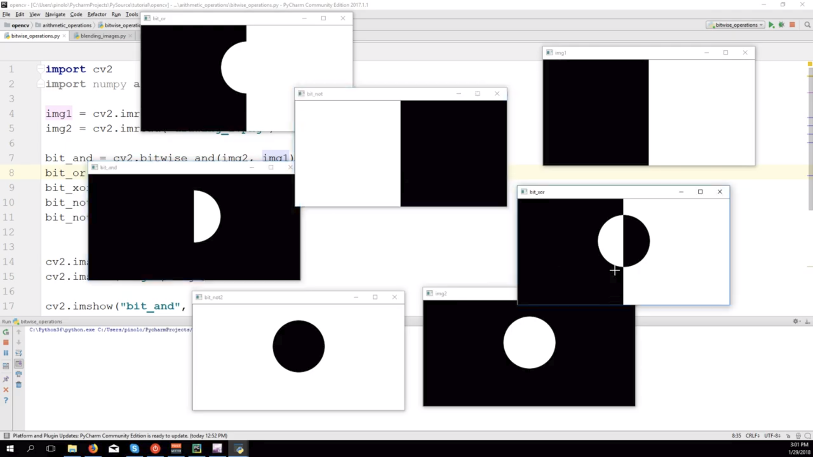

```python
cv.bitwise_and(img1, img2)
cv.bitwise_or(img1, img2)
cv.bitwise_xor(img1, img2)
cv.bitwise_not(img)

# You can also apply a mask as a final filter!
# Only pixels that pass the mask will be passed forward to the output

# Eg. cv.bitwise_and(img1, img2, mask=mask_img)
```

**Example Usage**

Source: https://docs.opencv.org/3.0-beta/doc/py_tutorials/py_core/py_image_arithmetics/py_image_arithmetics.html#image-arithmetics


```python
# Load two images
img1 = cv.imread('messi5.jpg')
img2 = cv.imread('opencv_logo.png')

# I want to put logo on top-left corner, So I create a ROI
rows,cols,channels = img2.shape
roi = img1[0:rows, 0:cols ]

# Now create a mask of logo and create its inverse mask also
img2gray = cv.cvtColor(img2,cv.COLOR_BGR2GRAY)
ret, mask = cv.threshold(img2gray, 10, 255, cv.THRESH_BINARY)
mask_inv = cv.bitwise_not(mask)

# Now black-out the area of logo in ROI
img1_bg = cv.bitwise_and(roi,roi,mask = mask_inv)

# Take only region of logo from logo image.
img2_fg = cv.bitwise_and(img2,img2,mask = mask)

# Put logo in ROI and modify the main image
dst = cv.add(img1_bg,img2_fg)
img1[0:rows, 0:cols ] = dst

cv.imshow('res',img1)
cv.waitKey(0)
cv.destroyAllWindows()
```


## 4. Basic Image Processing

### Changing Colourspaces

For the full list of colourspaces, run

```python
import cv2 as cv
flags = [i for i in dir(cv) if i.startswith('COLOR_')]
print(flags)
```

**Usage**

```python
hsv = cv.cvtColor(image, cv.COLOR_BGR2HSV)

# You can also use it to convert a single pixel!
green = np.uint8([[[0,255,0 ]]])
hsv_green = cv.cvtColor(green,cv.COLOR_BGR2HSV)
```

**Example**

Colour tracking: https://docs.opencv.org/3.4.4/df/d9d/tutorial_py_colorspaces.html


```python
import cv2 as cv
import numpy as np

cap = cv.VideoCapture(0)

while(1):
    # Take each frame
    _, frame = cap.read()
    # Convert BGR to HSV
    hsv = cv.cvtColor(frame, cv.COLOR_BGR2HSV)
    # define range of blue color in HSV
    lower_blue = np.array([110,50,50])
    upper_blue = np.array([130,255,255])
    # Threshold the HSV image to get only blue colors
    mask = cv.inRange(hsv, lower_blue, upper_blue)
    # Bitwise-AND mask and original image
    res = cv.bitwise_and(frame,frame, mask= mask)
    cv.imshow('frame',frame)
    cv.imshow('mask',mask)
    cv.imshow('res',res)
    k = cv.waitKey(5) & 0xFF
    if k == 27:
        break
cv.destroyAllWindows()
```


### Image Transformations

#### **Scaling**

Recommended interpolation methods:

- **cv.INTER_AREA** : For shrinking
- **cv.INTER_CUBIC** : For zooming

```python
# out = cv.resize(src, dsize[, dst[, fx[, fy[, interpolation)


# Explicit (Scaling factors automatically calculated)
dst = cv2.resize(src, (width, height), interpolation = cv2.INTER_CUBIC)

# Implicit (By scaling factors)
dst = cv2.resize(src, None, fx = 2, fy = 2, interpolation = cv2.INTER_CUBIC)
```

#### **Translating**

You translate using an affine transformation matrix

```python
# M = cv.warpAffine(img, affine_matrix, (output_x, output_y))

SHIFT_MATRIX = np.float32([[1,0,x_shf],[0,1, y_shf]])
dst = cv.warpAffine(img, SHIFT_MATRIX, (cols,rows))
```

#### **Rotating**

```python
# M = cv.getRotationMatrix2D(center, angle, scale)

# Rotate by 90 degrees
M = cv.getRotationMatrix2D((width/2.0, height/2.0), 90, 1)
dst = cv.warpAffine(img, M, (cols, rows))
```

#### **General Affine Transformation**

All parallel lines are preserved. (Shear, Translate, Rotate, Scale)

To do this, take 4 points on input image, and the same 4 points on output image. OpenCV will calculate the required transformation matrix to achieve the desired output!

**Example**

```python
# out = cv.warpAffine(img, trans_matrix, (out_x, out_y))

try:
    rows, cols, ch = img.shape
except:
    rows, cols = img.shape

pts_in = np.float32([[50,50],[200,50],[50,200]])
pts_out = np.float32([[10,100],[200,50],[100,250]])

M = cv.getAffineTransform(pts1,pts2)
dst = cv.warpAffine(img,M,(cols,rows))
```

#### **Perspective Transformations**

Straight lines remain straight but not necessarily parallel.

As is with the affine transformations, you need 4 input and output points.

```python
# out = cv.warpPerspective(img, trans_matrix, (out_x, out_y))

pts_in = np.float32([[56,65],[368,52],[28,387],[389,390]])
pts_out = np.float32([[0,0],[300,0],[0,300],[300,300]])

M = cv.getPerspectiveTransform(pts_in,pts_out)
dst = cv.warpPerspective(img,M,(300,300))
```


### Image Thresholding

#### **Simple**

Threshold Types:

- **cv.THRESH_BINARY**
- **cv.THRESH_BINARY_INV**
- **cv.THRESH_TRUNC**
- **cv.THRESH_TOZERO**
- **cv.THRESH_TOZERO_INV**


```python
# ret, thresholded_img = cv.threshold(img, lower, upper, threshold_type)
```

#### **Adaptive**

Methods:

- **cv.ADAPTIVE_THRESH_MEAN_C**
- **cv.ADAPTIVE_THRESH_GAUSSIAN_C**


```python
# out = cv.adaptiveThreshold(img, upper, method, threshold_types, neighbourhood_size, constant_subtraction)

th2 = cv.adaptiveThreshold(img,255,cv.ADAPTIVE_THRESH_MEAN_C,cv.THRESH_BINARY,11,2)
th3 = cv.adaptiveThreshold(img,255,cv.ADAPTIVE_THRESH_GAUSSIAN_C,cv.THRESH_BINARY,11,2)
```

#### **Otsu's Binarization**

Useful for images who have histograms with two peaks only.


```python
# Source: https://docs.opencv.org/3.4.4/d7/d4d/tutorial_py_thresholding.html

# global thresholding
ret1,th1 = cv.threshold(img,127,255,cv.THRESH_BINARY)
# Otsu's thresholding
ret2,th2 = cv.threshold(img,0,255,cv.THRESH_BINARY+cv.THRESH_OTSU)
# Otsu's thresholding after Gaussian filtering
blur = cv.GaussianBlur(img,(5,5),0)
ret3,th3 = cv.threshold(blur,0,255,cv.THRESH_BINARY+cv.THRESH_OTSU)
```


### Convolving Images


So if we want to smooth an image, we can convolve with an averaging kernel!


```python
kernel = np.ones((5,5),np.float32)/25
dst = cv.filter2D(img,-1,kernel)
```


### Smoothing Images

**Averaging**


```python
# cv.blur(img, kernel_dimensions)

blur = cv.blur(img,(5,5))
```

#### **Gaussian Blurring**


```python
# cv.GaussianBlur(img, kernel_dimensions, std_dev_x, std_dev_y)

blur = cv.GaussianBlur(img,(5,5),0)
```

#### **Median Blurring**


 Good for noise removal!

```python
# cv.medianBlur(img, kernel_size) kernel_size must be positive and odd

median = cv.medianBlur(img,5)
```

#### **Bilateral Filtering**

Removes noise while keeping edges sharp. (It's slow though!)

Only pixels with similar intensity neighbours will be blurred


- **sigmaColor**: 
  A larger value of the parameter means that farther colors within the pixel neighborhood (see sigmaSpace) will be mixed together, resulting in larger areas of semi-equal color.

- **sigmaSpace**: Filter sigma in the coordinate space. 

  A larger value of the parameter means that farther pixels will influence each other as long as their colors are close enough (see sigmaColor ). When d>0, it specifies the neighborhood size regardless of sigmaSpace. Otherwise, d is proportional to sigmaSpace.

```python
# cv.bilateralFilter(img, neighbourhood_diameter, sigmaColor, sigmaSpace)

blur = cv.bilateralFilter(img,9,75,75)
```


### Morphological Transformations


#### **Erosion**


Pixel in original image is considered 1 only if all pixels under the kernel is 1.

```python
kernel = np.ones((5,5),np.uint8)
erosion = cv.erode(img,kernel,iterations = 1)
```

#### **Dilation**


```python
dilation = cv.dilate(img,kernel,iterations = 1)
```

#### **Opening**

Erode, then dilate. Good for removing noise!


```python
opening = cv.morphologyEx(img, cv.MORPH_OPEN, kernel)
```

#### **Closing**

Dilate, then erode. Good for closing holes.


```python
closing = cv.morphologyEx(img, cv.MORPH_CLOSE, kernel)
```

#### **Morphological Gradient**

Find difference between dilation and erosion. Sort of gives you an outline.


```python
gradient = cv.morphologyEx(img, cv.MORPH_GRADIENT, kernel)
```

#### **Top Hat**

Difference between input and opening.

> The white top-hat transform returns an image, containing those "objects" or "elements" of an input image that:
>
> - Are "smaller" than the structuring element (i.e., places where the structuring element does not fit in), and
> - are **brighter** than their surroundings.
>
> **Before**
>
> 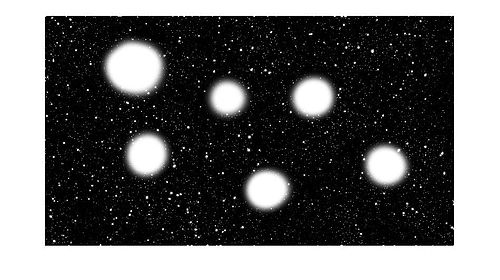
>
> **After**
>
> 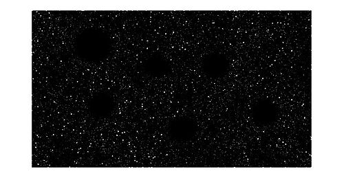
>
> https://en.wikipedia.org/wiki/Top-hat_transform


You can use it for isolating bright objects under non-uniform illumination too!

```python
tophat = cv.morphologyEx(img, cv.MORPH_TOPHAT, kernel)
```

#### **Black Hat**

Difference between input and closing.

> The black top-hat returns an image, containing the "objects" or "elements" that:
>
> - Are "smaller" than the structuring element, and
> - are **darker** than their surroundings.
> - https://en.wikipedia.org/wiki/Top-hat_transform


```python
blackhat = cv.morphologyEx(img, cv.MORPH_BLACKHAT, kernel)
```

#### **Creating Kernels**

OpenCV has some commands to help with creating specially shaped kernels.

```python
# Rectangular Kernel
>>> cv.getStructuringElement(cv.MORPH_RECT,(5,5))
array([[1, 1, 1, 1, 1],
       [1, 1, 1, 1, 1],
       [1, 1, 1, 1, 1],
       [1, 1, 1, 1, 1],
       [1, 1, 1, 1, 1]], dtype=uint8)

# Elliptical Kernel
>>> cv.getStructuringElement(cv.MORPH_ELLIPSE,(5,5))
array([[0, 0, 1, 0, 0],
       [1, 1, 1, 1, 1],
       [1, 1, 1, 1, 1],
       [1, 1, 1, 1, 1],
       [0, 0, 1, 0, 0]], dtype=uint8)

# Cross-shaped Kernel
>>> cv.getStructuringElement(cv.MORPH_CROSS,(5,5))
array([[0, 0, 1, 0, 0],
       [0, 0, 1, 0, 0],
       [1, 1, 1, 1, 1],
       [0, 0, 1, 0, 0],
       [0, 0, 1, 0, 0]], dtype=uint8)
```


### Image Gradients


Tip: It's recommended to gaussian blur a tiny bit before applying these filters to remove noise!

#### **Sobel Operator**

https://www.youtube.com/watch?v=uihBwtPIBxM

It's an approximation of the derivatives of an image wrt. x or y

```python
sobelx = cv.Sobel(img,cv.CV_64F,1,0,ksize=5)
sobely = cv.Sobel(img,cv.CV_64F,0,1,ksize=5)
```

#### **Laplacian**

Think minima and maxima!

```python
laplacian = cv.Laplacian(img,cv.CV_64F)
```

#### **Important Note**

> In our last example, output datatype is cv.CV_8U or np.uint8. But there is a slight problem with that. Black-to-White transition is taken as Positive slope (it has a positive value) while White-to-Black transition is taken as a Negative slope (It has negative value). So when you convert data to np.uint8, all negative slopes are made zero. In simple words, you miss that edge.
>
> If you want to detect both edges, better option is to keep the output datatype to some higher forms, like cv.CV_16S, cv.CV_64F etc, take its absolute value and then convert back to cv.CV_8U. Below code demonstrates this procedure for a horizontal Sobel filter and difference in results.


```python
# Output dtype = cv.CV_8U
sobelx8u = cv.Sobel(img,cv.CV_8U,1,0,ksize=5)

# Output dtype = cv.CV_64F. Then take its absolute and convert to cv.CV_8U
sobelx64f = cv.Sobel(img,cv.CV_64F,1,0,ksize=5)
abs_sobel64f = np.absolute(sobelx64f)
sobel_8u = np.uint8(abs_sobel64f)
```


### Image Pyramids


Upscale and downscale!

```python
lower_reso = cv.pyrDown(higher_reso)
higher_reso2 = cv.pyrUp(lower_reso) # Once you downscale, you lose resolution!
```

higher_reso2:


Pyramids are useful for scale-invariant feature detection (SIFT/SURF), and [blending](https://docs.opencv.org/3.4.4/dc/dff/tutorial_py_pyramids.html)!


## 5. Advanced Image Processing

### Canny Edge Detection

https://www.youtube.com/watch?v=sRFM5IEqR2w

Find dominant edges!


The threshold limits are for hysteresis thresholding.

.jpg)

```python
# cv.Canny(img, threshold_lower, threshold_upper)

edges = cv.Canny(img,100,200)
```


### Histogram Equalisation


```python
equ = cv.equalizeHist(img) # Easy!
```


### Adaptive Histogram Equalisation (CLAHE)

CLAHE divides the image into tiled blocks, equalises each, then stiches all the tiles together.

It's a way better method I think!

**Non-adaptive:**


**Adaptive:**


```python
clahe = cv.createCLAHE(clipLimit=2.0, tileGridSize=(8,8))
cl1 = clahe.apply(img)
```


### Hough Lines

Algorithm Explanation: https://www.youtube.com/watch?v=4zHbI-fFIlI&t=301s

Line definition:

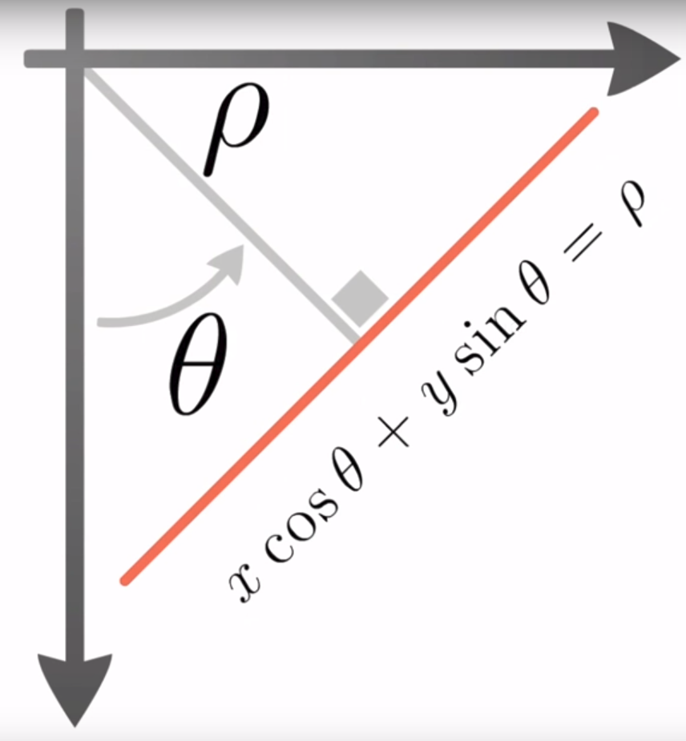

Line: **y=mx+c** or **ρ=xcosθ+ysinθ**

**It's best to provide a binarised, possibly skeletonised image into the Hough line transform**

```python
# cv.HoughLines(img, p_scan_resolution, theta_scan_resolution, threshold[, ...)
```

Example:


```python
# Source: https://docs.opencv.org/3.4.4/d6/d10/tutorial_py_houghlines.html

img = cv.imread(cv.samples.findFile('sudoku.png'))
gray = cv.cvtColor(img,cv.COLOR_BGR2GRAY)
edges = cv.Canny(gray,50,150,apertureSize = 3)
lines = cv.HoughLines(edges,1,np.pi/180,200)

for line in lines:
    rho,theta = line[0]
    a = np.cos(theta)
    b = np.sin(theta)

    x0 = a*rho
    y0 = b*rho

    x1 = int(x0 + 1000*(-b)) # y = c + mx
    y1 = int(y0 + 1000*(a))
    x2 = int(x0 - 1000*(-b))
    y2 = int(y0 - 1000*(a))

    cv.line(img,(x1,y1),(x2,y2),(0,0,255),2)

cv.imwrite('houghlines3.jpg',img)
```


### Probabilistic Hough Lines

Of course, since the normal hough transform is iterative, it's not so efficient.

We can use a probalistic version of the algorithm that takes a subset of edge points instead of all of them!


- **minLineLength** : Reject line segments shorter than this length
- **maxLineGap** : Max gap allowed for separate line segments to be treated as a single line

```python
# cv.HoughLinesP(img, p_scan_resolution, theta_scan_resolution, threshold[, minLineLength, maxLineGap ...)
```

Example:


```python
# Source: https://docs.opencv.org/3.4.4/d6/d10/tutorial_py_houghlines.html
import cv2 as cv
import numpy as np

img = cv.imread(cv.samples.findFile('sudoku.png'))
gray = cv.cvtColor(img,cv.COLOR_BGR2GRAY)
edges = cv.Canny(gray,50,150,apertureSize = 3)
lines = cv.HoughLinesP(edges,1,np.pi/180,100,minLineLength=100,maxLineGap=10)

for line in lines:
    x1,y1,x2,y2 = line[0]
    cv.line(img,(x1,y1),(x2,y2),(0,255,0),2)
cv.imwrite('houghlines5.jpg',img)
```

#### **Finding Equation of Line from 2 points**

```python
# Gradient
m = (y1 - y2) / (x1 - x2)

# Equation:
y = m(x - x1) + y1
```


### Hough Circles

I'm just putting this here since it's right after hough line detection. The hough circles detector requires a lot of tuning and you're probably better off using a blob detector I'll run through in a later section, or some other solution.

Still, if you really want to use the detector, I suggest tuning it with some trackbars, and making sure you're aware that the settings for one type of image won't really transfer to the universe of all possible images out there.

**I find that the minRadius parameter is quite buggy, so I leave it at zero most times.**

```python
# cv.HoughCircles(img, cv.HOUGH_GRADIENT, inverse_accumulator_resolution,
#                 min_dist_between_circles[, canny_upper_limit, threshold,
#                 minRadius, maxRadius)

# Actual names: image, method, dp, minDist, circles, param1, param2, minRadius, maxRadius
```

**Test Code** with trackbars!

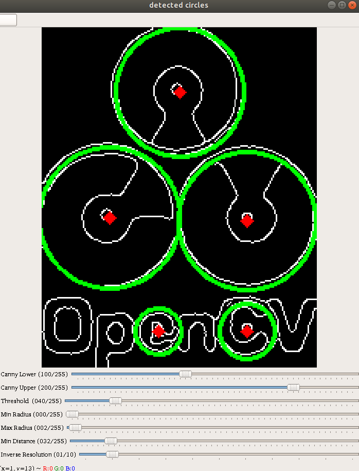

```python
import numpy as np
import cv2 as cv

img = cv.imread('houghcircles2.jpg',0)

def f(x=None):
    return

cv.namedWindow('detected circles', cv.WINDOW_NORMAL)
cv.createTrackbar('Canny Lower', 'detected circles', 100, 255, f)
cv.createTrackbar('Canny Upper', 'detected circles', 200, 255, f)
cv.createTrackbar('Threshold', 'detected circles', 40, 255, f)
cv.createTrackbar('Min Radius', 'detected circles', 0, 255, f)
cv.createTrackbar('Max Radius', 'detected circles', 2, 255, f)
cv.createTrackbar('Min Distance', 'detected circles', 32, 255, f)
cv.createTrackbar('Inverse Resolution', 'detected circles', 1, 10, f)

img = cv.medianBlur(img, 5)

while True:

    canny_lower = cv.getTrackbarPos('Canny Lower', 'detected circles')
    canny_upper = cv.getTrackbarPos('Canny Upper', 'detected circles')
    threshold = cv.getTrackbarPos('Threshold', 'detected circles')
    max_radius = cv.getTrackbarPos('Min Radius', 'detected circles')
    min_radius = cv.getTrackbarPos('Max Radius', 'detected circles')
    min_distance = cv.getTrackbarPos('Min Distance', 'detected circles')
    inverse_resolution = cv.getTrackbarPos('Inverse Resolution', 'detected circles')

    canny = cv.Canny(img, canny_lower, canny_upper)
    cimg = cv.cvtColor(canny,cv.COLOR_GRAY2BGR)

    try:
        circles = cv.HoughCircles(img,cv.HOUGH_GRADIENT,
                                  inverse_resolution,
                                  min_distance,
                                  param1=canny_upper,
                                  param2=threshold,
                                  minRadius=min_radius,
                                  maxRadius=max_radius)

        circles = np.uint16(np.around(circles))

        for i in circles[0,:]:
            # draw the outer circle
            cv.circle(cimg,(i[0],i[1]),i[2],(0,255,0),2)
            # draw the center of the circle
            cv.circle(cimg,(i[0],i[1]),2,(0,0,255),3)
    except:
        pass

    cv.imshow('detected circles',cimg)

    if cv.waitKey(10) & 0xFF == 27 or cv.waitKey(10) & 0xFF == 'q':
        break


cv.destroyAllWindows()
```


### Blob Detection

> A Blob is a group of connected pixels in an image that share some common property ( E.g grayscale value ). In the image above, the dark connected regions are blobs, and the goal of blob detection is to identify and mark these regions.
>
> SimpleBlobDetector, as the name implies, is based on a rather simple algorithm described below. The algorithm is controlled by parameters ( shown in bold below )  and has the following steps. Scroll down to know how the parameters are set.
>
> 1. **Thresholding :** Convert the source images to *several* binary images by thresholding the source image with thresholds starting at **minThreshold**. These thresholds are incremented  by **thresholdStep**until **maxThreshold**. So the first threshold is **minThreshold,** the second is **minThreshold** + **thresholdStep,** the third is **minThreshold** + **2 x thresholdStep**, and so on.
> 2. **Grouping :** In each binary image,  connected white pixels are grouped together.  Let’s call these binary blobs.
> 3. **Merging**  : The centers of the binary blobs in the binary images are computed, and  blobs located closer than **minDistBetweenBlobs** are merged.
> 4. **Center & Radius Calculation :**  The centers and radii of the new merged blobs are computed and returned.
>
> https://www.learnopencv.com/blob-detection-using-opencv-python-c/

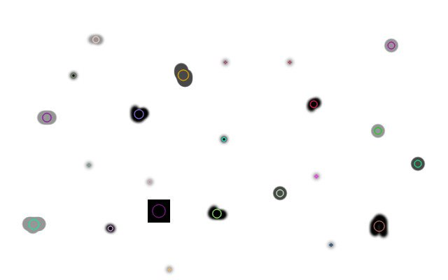

Image source: https://www.learnopencv.com/blob-detection-using-opencv-python-c/

OpenCV has a blob detector! It's pretty great.

```python
detector = cv2.SimpleBlobDetector()
keypoints = detector.detect(im)

img = cv2.drawKeypoints(img, keypoints, np.array([]), (0,0,255), cv2.DRAW_MATCHES_FLAGS_DRAW_RICH_KEYPOINTS)
```

**Blob Detector Parameters**

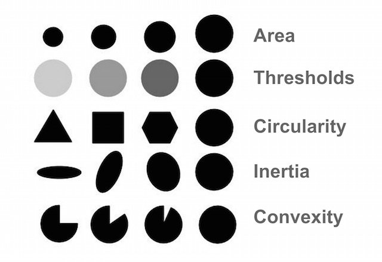

Image source: https://www.learnopencv.com/blob-detection-using-opencv-python-c/

**Unfortunately, you can't get the parameters for the detected blobs, only filter them.**

You COULD get their contours and then get the contour features though!

```python
# Setup SimpleBlobDetector parameters.
params = cv2.SimpleBlobDetector_Params()
 
# Change thresholds
params.minThreshold = 10;
params.maxThreshold = 200;
 
# Filter by Area.
params.filterByArea = True
params.minArea = 1500
params.maxArea = 5000
 
# Filter by Circularity
params.filterByCircularity = True
params.minCircularity = 0.1
params.maxCircularity = 1
    
# Filter by Convexity
params.filterByConvexity = True
params.minConvexity = 0.87
params.maxConvexity = 1
 
# Filter by Inertia
params.filterByInertia = True
params.minInertiaRatio = 0.01
params.maxIntertiaRatio = 1
    
# Create a detector with the parameters
ver = (cv2.__version__).split('.')
if int(ver[0]) < 3 :
    detector = cv2.SimpleBlobDetector(params)
else : 
    detector = cv2.SimpleBlobDetector_create(params)
```


### Image Denoising

OpenCV has four denoisers, using the non-local means denoising algorithm.


> So idea is simple, we need a set of similar images to average out the noise. Consider a small window (say 5x5 window) in the image. Chance is large that the same patch may be somewhere else in the image. Sometimes in a small neighbourhood around it. What about using these similar patches together and find their average? For that particular window, that is fine. See the example image.
>
> The blue patches in the image looks the similar. Green patches looks similar. So we take a pixel, take small window around it, search for similar windows in the image, average all the windows and replace the pixel with the result we got. This method is Non-Local Means Denoising. It takes more time compared to blurring techniques we saw earlier, but its result is very good. More details and online demo can be found at first link in additional resources.
>
> For color images, image is converted to CIELAB colorspace and then it separately denoise L and AB components.
>
> https://docs.opencv.org/3.4.4/d5/d69/tutorial_py_non_local_means.html

There are four denoisers available for use:

1. **cv.fastNlMeansDenoising()** - works with a single grayscale images
2. **cv.fastNlMeansDenoisingColored()** - works with a color image.
3. **cv.fastNlMeansDenoisingMulti()** - works with image sequence captured in short period of time (grayscale images)
4. **cv.fastNlMeansDenoisingColoredMulti()** - same as above, but for color images.

Common arguments are:

- h : parameter deciding filter strength. Higher h value removes noise better, but removes details of image also. (10 is ok)
- hColor : same as h, but for color images only. (normally same as h)
- templateWindowSize : should be odd. (recommended 7)
- searchWindowSize : should be odd. (recommended 21)

**Examples**


```python
# Source: https://docs.opencv.org/3.4.4/d5/d69/tutorial_py_non_local_means.html

import numpy as np
import cv2 as cv
from matplotlib import pyplot as plt

img = cv.imread('die.png')
# args: img, dst, h, hColor, template_window_size, search_window_size
dst = cv.fastNlMeansDenoisingColored(img,None,10,10,7,21)

plt.subplot(121),plt.imshow(img)
plt.subplot(122),plt.imshow(dst)
plt.show()
```


```python
# Source: https://docs.opencv.org/3.4.4/d5/d69/tutorial_py_non_local_means.html

import numpy as np
import cv2 as cv
from matplotlib import pyplot as plt

cap = cv.VideoCapture('vtest.avi')

# create a list of first 5 frames
img = [cap.read()[1] for i in xrange(5)]

# convert all to grayscale
gray = [cv.cvtColor(i, cv.COLOR_BGR2GRAY) for i in img]

# convert all to float64
gray = [np.float64(i) for i in gray]

# create a noise of variance 25
noise = np.random.randn(*gray[1].shape)*10

# Add this noise to images
noisy = [i+noise for i in gray]

# Convert back to uint8
noisy = [np.uint8(np.clip(i,0,255)) for i in noisy]

# Denoise 3rd frame considering all the 5 frames
# args: img, img_to_denoise_index, temporal_window_size, dst, h, template_window_size, search_window_size
dst = cv.fastNlMeansDenoisingMulti(noisy, 2, 5, None, 4, 7, 35)

plt.subplot(131),plt.imshow(gray[2],'gray')
plt.subplot(132),plt.imshow(noisy[2],'gray')
plt.subplot(133),plt.imshow(dst,'gray')
plt.show()
```


### Image Inpainting

OpenCV has two inpainting algorithms implemneted.

- **cv.INPAINT_TELEA** : Takes normalised weighted sum of immediate neighbourhood

- **cv.INPAINT_NS** : Navier-stokes, fluid dynamics related. Uses partial differential equations.

Replace degraded marks with their neighbourhood.


Bottom left is using TELEA. Bottom rihght is using NS.

You must provide a mask.

```python
import numpy as np
import cv2 as cv

img = cv.imread('messi_2.jpg')
mask = cv.imread('mask2.png',0)

dst = cv.inpaint(img,mask,3,cv.INPAINT_TELEA)

cv.imshow('dst',dst)
cv.waitKey(0)
cv.destroyAllWindows()
```


### Merging HDR Images

Combine images taken at different exposures!


Note: The HDR mergers have their own parameters. You might want to play with them.

```python
# Source: https://docs.opencv.org/3.4.4/d2/df0/tutorial_py_hdr.html

import cv2 as cv
import numpy as np

# Loading exposure images into a list
# You NEED the exposure times for some algorithms!
img_fn = ["img0.jpg", "img1.jpg", "img2.jpg", "img3.jpg"]
img_list = [cv.imread(fn) for fn in img_fn]
exposure_times = np.array([15.0, 2.5, 0.25, 0.0333], dtype=np.float32)

# Merge exposures to HDR image (they'll be float32, not uint8)
merge_debevec = cv.createMergeDebevec()
hdr_debevec = merge_debevec.process(img_list, times=exposure_times.copy())
merge_robertson = cv.createMergeRobertson()
hdr_robertson = merge_robertson.process(img_list, times=exposure_times.copy())

# Tonemap HDR image
tonemap1 = cv.createTonemapDurand(gamma=2.2)
res_debevec = tonemap1.process(hdr_debevec.copy())
tonemap2 = cv.createTonemapDurand(gamma=1.3)
res_robertson = tonemap2.process(hdr_robertson.copy())

# Exposure fusion using Mertens (here's the third method to merge, no need to tonemap or get exposure times)
merge_mertens = cv.createMergeMertens()
res_mertens = merge_mertens.process(img_list)

# Convert datatype to 8-bit and save
res_debevec_8bit = np.clip(res_debevec*255, 0, 255).astype('uint8')
res_robertson_8bit = np.clip(res_robertson*255, 0, 255).astype('uint8')
res_mertens_8bit = np.clip(res_mertens*255, 0, 255).astype('uint8')
cv.imwrite("ldr_debevec.jpg", res_debevec_8bit)
cv.imwrite("ldr_robertson.jpg", res_robertson_8bit)
cv.imwrite("fusion_mertens.jpg", res_mertens_8bit)
```


Debevec


Robertson


Mertens


#### **Estimating Camera Response Function**


```python
# Estimate camera response function (CRF)
cal_debevec = cv.createCalibrateDebevec()
crf_debevec = cal_debevec.process(img_list, times=exposure_times)
hdr_debevec = merge_debevec.process(img_list, times=exposure_times.copy(), response=crf_debevec.copy())

cal_robertson = cv.createCalibrateRobertson()
crf_robertson = cal_robertson.process(img_list, times=exposure_times)
hdr_robertson = merge_robertson.process(img_list, times=exposure_times.copy(), response=crf_robertson.copy())
```


### Fourier Transform

Intuition: https://www.youtube.com/watch?v=spUNpyF58BY

Uses: https://www.youtube.com/watch?v=gwaYwRwY6PU

Filter examples: http://web.archive.org/web/20130513181427id_/http://sharp.bu.edu/~slehar/fourier/fourier.html#filtering

#### **In Numpy**


White region (indicates high population) is at center (low frequency)

```python
# Numpy implementation
# np.fft.fft2(img)

import cv2 as cv
import numpy as np
from matplotlib import pyplot as plt

img = cv.imread('messi5.jpg',0)
f = np.fft.fft2(img)
fshift = np.fft.fftshift(f) # Shifts zero frequency to center (it starts at top left)
magnitude_spectrum = 20*np.log(np.abs(fshift))

plt.subplot(121),plt.imshow(img, cmap = 'gray')
plt.title('Input Image'), plt.xticks([]), plt.yticks([])
plt.subplot(122),plt.imshow(magnitude_spectrum, cmap = 'gray')
plt.title('Magnitude Spectrum'), plt.xticks([]), plt.yticks([])
plt.show()
```

Example processing in transformed form


Red arrow shows a ripple defect that's a result of using a rectangular mask. To get rid of it, use a gaussian mask instead.

```python
# Numpy high pass filter
# High pass filter is sort of like an edge detector! Cool!

rows, cols = img.shape
crow,ccol = rows//2 , cols//2

fshift[crow-30:crow+31, ccol-30:ccol+31] = 0 # Mask lower frequencies
f_ishift = np.fft.ifftshift(fshift) # Inverse shift
img_back = np.fft.ifft2(f_ishift) # Inverse FFT
img_back = np.real(img_back)

plt.subplot(131),plt.imshow(img, cmap = 'gray')
plt.title('Input Image'), plt.xticks([]), plt.yticks([])
plt.subplot(132),plt.imshow(img_back, cmap = 'gray')
plt.title('Image after HPF'), plt.xticks([]), plt.yticks([])
plt.subplot(133),plt.imshow(img_back)
plt.title('Result in JET'), plt.xticks([]), plt.yticks([])
plt.show()
```

#### **In OpenCV**

(Faster than numpy!)

> - If [DFT_ROWS](https://docs.opencv.org/3.4.4/d2/de8/group__core__array.html#ggaf4dde112b483b38175621befedda1f1ca1744dc1cf1249944bc841e78c1565b7f) is set or the input array has a single row or single column, the function performs a 1D forward or inverse transform of each row of a matrix when [DFT_ROWS](https://docs.opencv.org/3.4.4/d2/de8/group__core__array.html#ggaf4dde112b483b38175621befedda1f1ca1744dc1cf1249944bc841e78c1565b7f) is set. Otherwise, it performs a 2D transform.
> - If the input array is real and
>
> 
>
> DFT_INVERSE
>
> 
>
> is not set, the function performs a forward 1D or 2D transform:
>
> - When [DFT_COMPLEX_OUTPUT](https://docs.opencv.org/3.4.4/d2/de8/group__core__array.html#ggaf4dde112b483b38175621befedda1f1ca07b45079b38d60e7837dfb666a55299b) is set, the output is a complex matrix of the same size as input.
> - When [DFT_COMPLEX_OUTPUT](https://docs.opencv.org/3.4.4/d2/de8/group__core__array.html#ggaf4dde112b483b38175621befedda1f1ca07b45079b38d60e7837dfb666a55299b) is not set, the output is a real matrix of the same size as input. In case of 2D transform, it uses the packed format as shown above. In case of a single 1D transform, it looks like the first row of the matrix above. In case of multiple 1D transforms (when using the [DFT_ROWS](https://docs.opencv.org/3.4.4/d2/de8/group__core__array.html#ggaf4dde112b483b38175621befedda1f1ca1744dc1cf1249944bc841e78c1565b7f) flag), each row of the output matrix looks like the first row of the matrix above.
> - If the input array is complex and either [DFT_INVERSE](https://docs.opencv.org/3.4.4/d2/de8/group__core__array.html#ggaf4dde112b483b38175621befedda1f1ca4e01d7e91cae1dbb68a26767d7b636be) or [DFT_REAL_OUTPUT](https://docs.opencv.org/3.4.4/d2/de8/group__core__array.html#ggaf4dde112b483b38175621befedda1f1ca28347c7846e5eaed83e019cd003e8e03) are not set, the output is a complex array of the same size as input. The function performs a forward or inverse 1D or 2D transform of the whole input array or each row of the input array independently, depending on the flags DFT_INVERSE and DFT_ROWS.
> - When [DFT_INVERSE](https://docs.opencv.org/3.4.4/d2/de8/group__core__array.html#ggaf4dde112b483b38175621befedda1f1ca4e01d7e91cae1dbb68a26767d7b636be) is set and the input array is real, or it is complex but [DFT_REAL_OUTPUT](https://docs.opencv.org/3.4.4/d2/de8/group__core__array.html#ggaf4dde112b483b38175621befedda1f1ca28347c7846e5eaed83e019cd003e8e03) is set, the output is a real array of the same size as input. The function performs a 1D or 2D inverse transformation of the whole input array or each individual row, depending on the flags [DFT_INVERSE](https://docs.opencv.org/3.4.4/d2/de8/group__core__array.html#ggaf4dde112b483b38175621befedda1f1ca4e01d7e91cae1dbb68a26767d7b636be) and [DFT_ROWS](https://docs.opencv.org/3.4.4/d2/de8/group__core__array.html#ggaf4dde112b483b38175621befedda1f1ca1744dc1cf1249944bc841e78c1565b7f).

```python
# cv.dft() DFT
# cv.idft() Inverse DFT

import numpy as np
import cv2 as cv
from matplotlib import pyplot as plt

img = cv.imread('messi5.jpg',0)

# Input image needs to be converted to np.float32
dft = cv.dft(np.float32(img),flags = cv.DFT_COMPLEX_OUTPUT)
dft_shift = np.fft.fftshift(dft)

magnitude_spectrum = 20*np.log(cv.magnitude(dft_shift[:,:,0],dft_shift[:,:,1]))

plt.subplot(121),plt.imshow(img, cmap = 'gray')
plt.title('Input Image'), plt.xticks([]), plt.yticks([])
plt.subplot(122),plt.imshow(magnitude_spectrum, cmap = 'gray')
plt.title('Magnitude Spectrum'), plt.xticks([]), plt.yticks([])
plt.show()
```

**The output of cv.dft gives you  a two-channel image. Channel 1 is real, channel 2 is imaginary.**

You may use `cv.cartToPolar()` to turn it complex!

Let's try applying a low pass filter!


```python
rows, cols = img.shape
crow,ccol = rows/2 , cols/2

# create a mask first, center square is 1, remaining all zeros
mask = np.zeros((rows,cols,2),np.uint8)
mask[crow-30:crow+30, ccol-30:ccol+30] = 1

# apply mask and inverse DFT
fshift = dft_shift*mask
f_ishift = np.fft.ifftshift(fshift)
img_back = cv.idft(f_ishift)
img_back = cv.magnitude(img_back[:,:,0],img_back[:,:,1])

plt.subplot(121),plt.imshow(img, cmap = 'gray')
plt.title('Input Image'), plt.xticks([]), plt.yticks([])
plt.subplot(122),plt.imshow(img_back, cmap = 'gray')
plt.title('Magnitude Spectrum'), plt.xticks([]), plt.yticks([])
plt.show()
```

#### **Optimising for DFT**

Apparently the performance works best if your array is in a power of 2 and if the array's size is divisible by 2, 3, or 5.

```python
# Calculate optimal size
nrows = cv.getOptimalDFTSize(rows)
ncols = cv.getOptimalDFTSize(cols)

# Adjust image
nimg = np.zeros((nrows,ncols))
nimg[:rows,:cols] = img

# Adjust image (alt)
right = ncols - cols
bottom = nrows - rows
bordertype = cv.BORDER_CONSTANT
nimg = cv.copyMakeBorder(img,0,bottom,0,right,bordertype, value = 0)
```

You'll get about a 4x speedup!

#### **Fourier Transform for common kernels**


Ooo.


### Template Matching

Search for the location of a template image in a larger image. (It's not as robust as SIFT/SURF, but it's ok,)

Methods:
https://docs.opencv.org/3.4.4/df/dfb/group__imgproc__object.html#ga3a7850640f1fe1f58fe91a2d7583695d

- **cv.TM_CCOEFF**
- **cv.TM_CCOEFF_NORMED**
- **cv.TM_CCORR**
- **cv.TM_CCORR_NORMED**
- **cv.TM_SQDIFF**
- **cv.TM_SQDIFF_NORMED**

```python
# cv.matchTemplate(img, template, method)

# Then use cv.minMaxLoc(response_image) to find the best match!
# min_val, max_val, min_loc, max_loc = cv.minMaxLoc(response_image)
```

#### **Single Matching**

Example:

```python
# https://docs.opencv.org/3.4.4/d4/dc6/tutorial_py_template_matching.html

import cv2 as cv
import numpy as np
from matplotlib import pyplot as plt

img = cv.imread('messi5.jpg',0)
img2 = img.copy()
template = cv.imread('template.jpg',0)
w, h = template.shape[::-1]

# All the 6 methods for comparison in a list
methods = ['cv.TM_CCOEFF', 'cv.TM_CCOEFF_NORMED', 'cv.TM_CCORR',
            'cv.TM_CCORR_NORMED', 'cv.TM_SQDIFF', 'cv.TM_SQDIFF_NORMED']

for meth in methods:
    img = img2.copy()
    method = eval(meth)

    # Apply template Matching
    res = cv.matchTemplate(img,template,method)
    min_val, max_val, min_loc, max_loc = cv.minMaxLoc(res)
    
    # If the method is TM_SQDIFF or TM_SQDIFF_NORMED, take minimum
    if method in [cv.TM_SQDIFF, cv.TM_SQDIFF_NORMED]:
        top_left = min_loc
    else:
        top_left = max_loc
    
    bottom_right = (top_left[0] + w, top_left[1] + h)
    cv.rectangle(img,top_left, bottom_right, 255, 2)
    
    plt.subplot(121),plt.imshow(res,cmap = 'gray')
    plt.title('Matching Result'), plt.xticks([]), plt.yticks([])
    plt.subplot(122),plt.imshow(img,cmap = 'gray')
    plt.title('Detected Point'), plt.xticks([]), plt.yticks([])
    plt.suptitle(meth)
    plt.show()
```

#### **Multiple Matches**

When you have multiple object detections, you can't use the min and max locations since the detections might occur over a range. So use a threshold!

Example:


```python
# Source: https://docs.opencv.org/3.4.4/d4/dc6/tutorial_py_template_matching.html

import cv2 as cv
import numpy as np
from matplotlib import pyplot as plt

img_rgb = cv.imread('mario.png')
img_gray = cv.cvtColor(img_rgb, cv.COLOR_BGR2GRAY)
template = cv.imread('mario_coin.png',0)
w, h = template.shape[::-1]

res = cv.matchTemplate(img_gray,template,cv.TM_CCOEFF_NORMED)
threshold = 0.8
loc = np.where( res >= threshold)

for pt in zip(*loc[::-1]):
    cv.rectangle(img_rgb, pt, (pt[0] + w, pt[1] + h), (0,0,255), 2)

cv.imwrite('res.png',img_rgb)
```


### Basic Image Segmentation with Watershed

The watershed algorithm is an algorithm that can be used to segment objects that are touching. 

To be fair, most modern approaches use deep learning approaches to do it, but this is a good way to start heuristically.

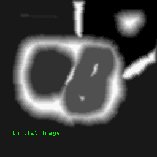

Source: http://www.cmm.mines-paristech.fr/~beucher/wtshed.html

> Any grayscale image can be viewed as a topographic surface where high intensity denotes peaks and hills while low intensity denotes valleys. You start filling every isolated valleys (local minima) with different colored water (labels). As the water rises, depending on the peaks (gradients) nearby, water from different valleys, obviously with different colors will start to merge. To avoid that, you build barriers in the locations where water merges. You continue the work of filling water and building barriers until all the peaks are under water. Then the barriers you created gives you the segmentation result. This is the "philosophy" behind the watershed.
>
> https://docs.opencv.org/3.4.4/d3/db4/tutorial_py_watershed.html

It's prone to oversegmentation, which is why you can either:

- a) use the improved algorithm (the P Algorithm, which hasn't been implemented in OpenCV yet)
- b) Use markers (which OpenCV uses)

Watershed and P Algorithm: http://www.cmm.mines-paristech.fr/~beucher/wtshed.html

OpenCV Docs: https://docs.opencv.org/3.4.4/d3/db4/tutorial_py_watershed.html

And here's what the process looks like with markers.

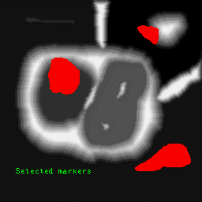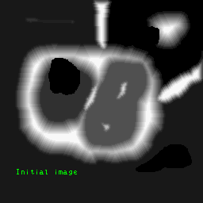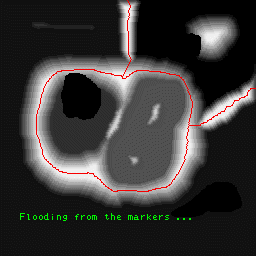

Source: http://www.cmm.mines-paristech.fr/~beucher/wtshed.html

**Example**

Source: https://docs.opencv.org/3.4.4/d3/db4/tutorial_py_watershed.html


Image to be segmented


Binarised image

```python
import numpy as np
import cv2 as cv
from matplotlib import pyplot as plt

img = cv.imread('coins.png')
gray = cv.cvtColor(img,cv.COLOR_BGR2GRAY)

# Otsu's Binarization
ret, thresh = cv.threshold(gray,0,255,cv.THRESH_BINARY_INV+cv.THRESH_OTSU)
```


Selected foreground and background


The two options for generating markers (so we don't have to manually draw them)

```python
# noise removal
kernel = np.ones((3,3),np.uint8)
opening = cv.morphologyEx(thresh,cv.MORPH_OPEN,kernel, iterations = 2)

# sure background area
sure_bg = cv.dilate(opening,kernel,iterations=3)

# Finding sure foreground area
dist_transform = cv.distanceTransform(opening,cv.DIST_L2,5)
ret, sure_fg = cv.threshold(dist_transform,0.7*dist_transform.max(),255,0)

# Finding unknown region
sure_fg = np.uint8(sure_fg)
unknown = cv.subtract(sure_bg,sure_fg)
```


```python
# Marker labelling
ret, markers = cv.connectedComponents(sure_fg)

# Add one to all labels so that sure background is not 0, but 1
markers = markers+1

# Now, mark the region of unknown with zero
markers[unknown==255] = 0
markers = cv.watershed(img,markers)
img[markers == -1] = [255,0,0]
```


## 6. Contours

> Contours can be explained simply as a curve joining all the continuous points (along the boundary), having same color or intensity. The contours are a useful tool for shape analysis and object detection and recognition.
>
> https://docs.opencv.org/3.4.4/d4/d73/tutorial_py_contours_begin.html

Use binary images for better accuracy! Apply the Canny edge detector, or image thresholding!

### Basic Contour Operations

#### **Find Contours**

This won't affect the input image

```python
# cv.findContours(img, retrieval_mode, contour_approximation_method)

im2, contours, hierarchy = cv.findContours(img, cv.RETR_TREE, cv.CHAIN_APPROX_SIMPLE)
```

#### **Draw Contours**

Note: This still affects the input image, like any other draw function!

```python
# image	= cv.drawContours(image, contours, contourIdx, color[,
#                         thickness, lineType, hierarchy, maxLevel, offset)

# If thickness is negative, draws a filled contour instead

# Draw all contours
cv.drawContours(img, contours, -1, (0,255,0), 3)

# Draw a contour
cv.drawContours(img, contours, 3, (0,255,0), 3)

# More useful single contour draw
cnt = contours[4]
cv.drawContours(img, [cnt], 0, (0,255,0), 3)
```

#### **Contour Approximation Methods**

The third argument of cv.findContours!

- **cv.CHAIN_APPROX_NONE** : Gives you many, many points (memory intensive)
- **cv.CHAIN_APPROX_SIMPLE** : Tries to give you endpoints (in this case, 4)


### Contour Features

#### **Moments**

Image moments info: https://www.youtube.com/watch?v=AAbUfZD_09s

```python
# M is a dictionary of moments!
M = cv.moments(cnt)

# cx - Centroid x coordinate, cy - Centroid y coordinate
# m00 is number of pixels that are white
# m10 is weighted sum weighted along x
# m01 is weighted sum weighted along y
cx = int(M['m10']/M['m00'])
cy = int(M['m01']/M['m00'])
```

#### **Contour Area**

Also equivalent to `cv.moments(cnt)['m00']`

It's the pixel area of all pixels in the contour! If your contour isn't filled or closed, it'll try to close it.

```python
area = cv.contourArea(cnt)
```

#### **Contour Perimeter**

```python
# cv.arcLength(contour, is_closed)

perimeter = cv.arcLength(cnt,True)
```

#### **Contour Approximation**

Useful to remove defects! Approximates contours to another with less vertices.


```python
# Max distance from contour to approximated contour
epsilon = 0.1*cv.arcLength(cnt,True)

# Approximated Contour
# cv.approxPolyDP(contour, epsilon, is_closed)
approx = cv.approxPolyDP(cnt,epsilon,True)
```

#### **Convex Hull**


Corrects convexity defects! (Makes things bulgy.)

```python
# hull = cv.convexHull(points[, hull, clockwise, returnPoints)
# returnPoints is default True. It'll return the bounding hull point coordinates
# If it's false, it'll return the contour indexes that correspond to those coordinates

hull = cv.convexHull(cnt)
```

You can also check if a curve is convex using this function!

```python
k = cv.isContourConvex(cnt)
```

#### **Bounding Rectangles**


```python
# Non-rotated
x,y,w,h = cv.boundingRect(cnt)

# Draw it!
cv.rectangle(img,(x,y),(x+w,y+h),(0,255,0),2)

# Rotated
rect = cv.minAreaRect(cnt)

# Draw it!
box = cv.boxPoints(rect)
box = np.int0(box)
cv.drawContours(img,[box],0,(0,0,255),2)
```

#### **Minimum Enclosing Circle**


```python
(x,y),radius = cv.minEnclosingCircle(cnt)

# Draw it!
center = (int(x),int(y))
radius = int(radius)
cv.circle(img,center,radius,(0,255,0),2)
```

#### **Fitted Ellipse**


```python
ellipse = cv.fitEllipse(cnt)

# Draw it!
cv.ellipse(img,ellipse,(0,255,0),2)
```

#### **Fitted Line**


```python
[vx,vy,x,y] = cv.fitLine(cnt, cv.DIST_L2,0,0.01,0.01)

# Draw it!
rows,cols = img.shape[:2]
lefty = int((-x*vy/vx) + y)
righty = int(((cols-x)*vy/vx)+y)
cv.line(img,(cols-1,righty),(0,lefty),(0,255,0),2)
```


### Contour Properties

#### **Aspect Ratio**

```python
x,y,w,h = cv.boundingRect(cnt)
aspect_ratio = float(w)/h
```

#### **Extent**

Contour area / bounding rectangle area

```python
area = cv.contourArea(cnt)
x,y,w,h = cv.boundingRect(cnt)
rect_area = w*h
extent = float(area)/rect_area
```

#### **Solidity**

Contour area / convex hull area

```python
area = cv.contourArea(cnt)
hull = cv.convexHull(cnt)
hull_area = cv.contourArea(hull)
solidity = float(area)/hull_area
```

#### **Equivalent Circle Diameter**

```python
area = cv.contourArea(cnt)
equi_diameter = np.sqrt(4*area/np.pi)
```

#### **Orientation**

```python
(x,y),(MA,ma),angle = cv.fitEllipse(cnt)
```

#### **Mask**

```python
mask = np.zeros(imgray.shape,np.uint8)
cv.drawContours(mask,[cnt],0,255,-1)

pixelpoints = np.transpose(np.nonzero(mask)) # Coordinates are (y, x)

#pixelpoints = cv.findNonZero(mask) Coordinates are (x, y)
```

#### **Min and Max Pixel Values**

You can use a mask to find a sub array. In this case, use the mask drawn from the filled contour

```python
mask = np.zeros(imgray.shape,np.uint8)
cv.drawContours(mask,[cnt],0,255,-1)

min_val, max_val, min_loc, max_loc = cv.minMaxLoc(imgray,mask = mask)
```

#### **Mean Colour or Mean Intensity**

Same thing, use the mask

```python
mean_val = cv.mean(im,mask = mask)
```

#### **Extreme Points**

Topmost, leftmost, bottommost, rightmost


```python
leftmost = tuple(cnt[cnt[:,:,0].argmin()][0])
rightmost = tuple(cnt[cnt[:,:,0].argmax()][0])
topmost = tuple(cnt[cnt[:,:,1].argmin()][0])
bottommost = tuple(cnt[cnt[:,:,1].argmax()][0])
```


### Convexity Defects

`cv.convexityDefects() returns` : An array of **[ start point, end point, farthest point, approximate distance to farthest point ]**.

```python
hull = cv.convexHull(cnt,returnPoints = False)
defects = cv.convexityDefects(cnt,hull)
```

Example usage:


```python
# Source: https://docs.opencv.org/3.4.4/d5/d45/tutorial_py_contours_more_functions.html

import cv2 as cv
import numpy as np

img = cv.imread('star.jpg')
img_gray = cv.cvtColor(img,cv.COLOR_BGR2GRAY)
ret,thresh = cv.threshold(img_gray, 127, 255,0)
im2,contours,hierarchy = cv.findContours(thresh,2,1)
cnt = contours[0]

hull = cv.convexHull(cnt,returnPoints = False)
defects = cv.convexityDefects(cnt,hull)

for i in range(defects.shape[0]):
    s,e,f,d = defects[i,0]
    start = tuple(cnt[s][0])
    end = tuple(cnt[e][0])
    far = tuple(cnt[f][0])
    cv.line(img,start,end,[0,255,0],2)
    cv.circle(img,far,5,[0,0,255],-1)

    cv.imshow('img',img)
cv.waitKey(0)
cv.destroyAllWindows()
```


### Shortest Distance to Contour

```python
# cv.pointPolygonTest(contour, point, measureDistance)

# If measureDistance is True, find distance (-ve if it's inside the contour)
# Else, return +1 if point is in contour, -1 if it's on contour, 0 otherwise

dist = cv.pointPolygonTest(cnt,(50,50),True)
```


### Match Shapes

The lower the better! It matches using Hu-Moments

```python
# Arguments are hard to explain. See doc: https://docs.opencv.org/3.4.4/d3/dc0/group__imgproc__shape.html#gaadc90cb16e2362c9bd6e7363e6e4c317

ret = cv.matchShapes(cnt1,cnt2,1,0.0)
```


### Contour Hierarchy

https://docs.opencv.org/3.4.4/d9/d8b/tutorial_py_contours_hierarchy.html

There were different fetching modes for the findContours() method. Here we'll explain them!

The hierarchy returned from that method is an array with elements: **[Next, Previous, First_Child, Parent]**, which are contour indices.

- **cv.RETR_LIST** : All contours, parent and child, are treated as equal

- **cv.RETR_EXTERNAL** : Retrieve outermost contours only

- **cv.RETR_CCOMP** : Two-level hierarchy. Outer boundaries are in the first hierarchy, inner boundaries are in the second.

  

- **cv.RETR_TREE** : Retrieve the full hierarchy list

  

   

## 7. Histograms


### Calculate Histogram

> 1. **images** : it is the source image of type uint8 or float32. it should be given in square brackets, ie, "[img]".
> 2. **channels** : it is also given in square brackets. It is the index of channel for which we calculate histogram. For example, if input is grayscale image, its value is [0]. For color image, you can pass [0], [1] or [2] to calculate histogram of blue, green or red channel respectively.
> 3. **mask** : mask image. To find histogram of full image, it is given as "None". But if you want to find histogram of particular region of image, you have to create a mask image for that and give it as mask. (I will show an example later.)
> 4. **histSize** : this represents our BIN count. Need to be given in square brackets. For full scale, we pass [256].
> 5. **ranges** : this is our RANGE. Normally, it is [0,256].
>
> https://docs.opencv.org/3.4.4/d1/db7/tutorial_py_histogram_begins.html

```python
# cv.calcHist(images, channels, mask, histSize, ranges[, hist, accumulate)

hist = cv.calcHist([img],[0],None,[256],[0,256])

# You can also use numpy, but it's about 40x slower
hist,bins = np.histogram(img.ravel(),256,[0,256])
```


### Plot Histogram


```python
# Using matplotlib directly
from matplotlib import pyplot as plt

img = cv.imread('home.jpg',0)
plt.hist(img.ravel(),256,[0,256]); plt.show()
```


```python
# Plot the individual channel histograms instead
img = cv.imread('home.jpg')
color = ('b','g','r')

for i,col in enumerate(color):
    histr = cv.calcHist([img],[i],None,[256],[0,256])
    plt.plot(histr,color = col)
    plt.xlim([0,256])

plt.show()
```


### Calculate 2D Histogram

Just add more channels in for the arguments!

The range argument is for 0_lower, 0_upper, 1_lower, 1_upper

```python
hist = cv.calcHist([hsv], [0, 1], None, [180, 256], [0, 180, 0, 256])
# Hue is limited to 0-180
# Saturation is 0-256

# You can also use numpy!
hist, xbins, ybins = np.histogram2d(h.ravel(),s.ravel(),[180,256],[[0,180],[0,256]])
```


### Plot 2D Histogram

```python
# Use OpenCV
cv.imshow(hist)

# Use matplotlib
plt.imshow(hist,interpolation = 'nearest')
plt.show()

# Colour coded histogram
# https://github.com/opencv/opencv/blob/master/samples/python/color_histogram.py
```


### Histogram Backprojection

https://docs.opencv.org/3.4.4/dc/df6/tutorial_py_histogram_backprojection.html

Get an image of an object of interest, and segment the image using the histogram!

Simply use:

```python
# cv.calcBackProject(images, channels, hist, ranges, scale)

cv.calcBackProject([hsvt],[0,1],roihist,[0,180,0,256],1)
```


```python
# https://docs.opencv.org/3.4.4/dc/df6/tutorial_py_histogram_backprojection.html

import numpy as np
import cv2 as cv

roi = cv.imread('rose_red.png')
hsv = cv.cvtColor(roi,cv.COLOR_BGR2HSV)
target = cv.imread('rose.png')
hsvt = cv.cvtColor(target,cv.COLOR_BGR2HSV)

# calculating object histogram
roihist = cv.calcHist([hsv],[0, 1], None, [180, 256], [0, 180, 0, 256] )

# normalize histogram and apply backprojection
cv.normalize(roihist,roihist,0,255,cv.NORM_MINMAX)
dst = cv.calcBackProject([hsvt],[0,1],roihist,[0,180,0,256],1)

# Now convolute with circular disc
disc = cv.getStructuringElement(cv.MORPH_ELLIPSE,(5,5))
cv.filter2D(dst,-1,disc,dst)

# threshold and binary AND
ret,thresh = cv.threshold(dst,50,255,0)
thresh = cv.merge((thresh,thresh,thresh))
res = cv.bitwise_and(target,thresh)
res = np.vstack((target,thresh,res))

cv.imwrite('res.jpg',res)
```


## 8. Saliency

**Requires opencv-contrib**

> In OpenCV’s saliency  module there are three primary forms of saliency detection:
>
> 1. **Static saliency:** This class of saliency detection algorithms relies on image features and statistics to localize the most interesting regions of an image.
> 2. **Motion saliency:** Algorithms in this class typically rely on video or frame-by-frame inputs. The motion saliency algorithms process the frames, keeping track of objects that “move”. Objects that move are considered salient.
> 3. **Objectness:** Saliency detection algorithms that compute “objectness” generate a set of “proposals”, or more simply bounding boxes of where it thinks an object may lie in an image.
>
> https://www.pyimagesearch.com/2018/07/16/opencv-saliency-detection/

**Note**

> **Keep in mind that computing saliency is not object detection.** The underlying saliency detection algorithm has *no idea* if there is a particular object in an image or not.
>
> Instead, the saliency detector is simply reporting where it *thinks* an object may lie in the image — it is up to you and your actual object detection/classification algorithm to:
>
> 1. Process the region proposed by the saliency detector
> 2. Predict/classify the region and make any decisions on this prediction
>
> https://www.pyimagesearch.com/2018/07/16/opencv-saliency-detection/

They're basically really fast heuristics for finding objects or things of interest! Most good processing pipelines use multiple cascading layers of detectors and heuristics, saliency detectors are a good first filter to select areas of interest that you can then use more computationally intensive algorithms to process.

It's a way to make your pipelines more efficient! Especially since saliency algorithms can run really fast!

Once you find the salient parts of the image, you can find the thresholds, and then the contours, and then the bounding boxes and hence the ROI!

**The available Saliency Detectors**

```python
# Static
cv2.saliency.StaticSaliencySpectralResidual_create()
cv2.saliency.StaticSaliencyFineGrained_create()

# Motion
cv2.saliency.MotionSaliencyBinWangApr2014_create()

# Objectness
cv2.saliency.ObjectnessBING_create()
```


### Static Saliency

1. **StaticSaliencySpectralResidual** : [*Saliency detection: A spectral residual approach*](http://bcmi.sjtu.edu.cn/~zhangliqing/Papers/2007CVPR_Houxiaodi_04270292.pdf).
2. **StaticSaliencyFineGrained** :  [*Human detection using a mobile platform and novel features derived from a visual saliency mechanism*](https://www.sciencedirect.com/science/article/pii/S0262885609001371).


**Spectral Method**

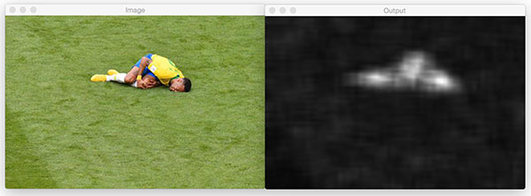


Image sources: https://www.pyimagesearch.com/2018/07/16/opencv-saliency-detection/

```python
import numpy as np
import cv2 as cv

img = cv.imread('test_img.jpg')

saliency = cv.saliency.StaticSaliencySpectralResidual_create()
(success, saliencyMap) = saliency.computeSaliency(img)

# Scale to 0, 255
saliencyMap = (saliencyMap * 255).astype("uint8")

cv.imshow("Image", img)
cv.imshow("Output", saliencyMap)
cv.waitKey(0)
cv.destroyAllWindows()
```


**Fine Grained Method**

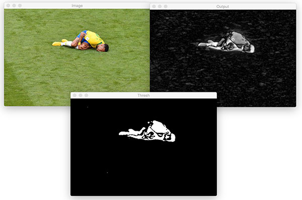

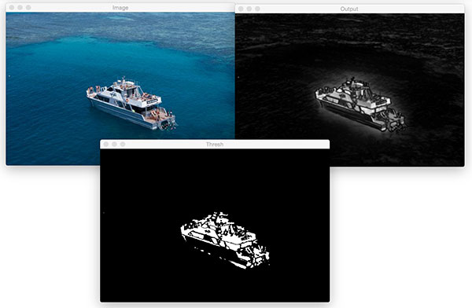

Image sources: https://www.pyimagesearch.com/2018/07/16/opencv-saliency-detection/

```python
import numpy as np
import cv2 as cv

img = cv.imread('test_img.jpg')

saliency = cv.saliency.StaticSaliencyFineGrained_create()
(success, saliencyMap) = saliency.computeSaliency(img)

saliencyMap_uint8 = (255 * saliencyMap).astype('uint8')
threshMap = cv.threshold(saliencyMap_uint8, 0, 255,cv.THRESH_BINARY + cv.THRESH_OTSU)[1]

cv.imshow("Image", img)
cv.imshow("Output", saliencyMap)
cv.imshow("Thresh", threshMap)
cv.waitKey(0)
cv.destroyAllWindows()
```


### Objectness Saliency

[*BING: Binarized normed gradients for objectness estimation at 300fps*](https://mmcheng.net/bing/)

You will need the bing_model. You can find it in the resources folder under `Models`, just make sure it's somewhere where the script can access it and you should be fine.

You can use the detections to get your bounding boxes.

```python
# Source: https://www.pyimagesearch.com/2018/07/16/opencv-saliency-detection/

import numpy as np
import cv2 as cv

img = cv.imread('test_img.jpg')
max_detections = 10

saliency = cv.saliency.ObjectnessBING_create()
saliency.setTrainingPath("bing_model")

(success, saliencyMap) = saliency.computeSaliency(img)
numDetections = saliencyMap.shape[0]

# loop over the detections
for i in range(0, min(numDetections, max_detections)):
	# extract the bounding box coordinates
	(startX, startY, endX, endY) = saliencyMap[i].flatten()

	# randomly generate a color for the object and draw it on the img
	output = img.copy()
	color = np.random.randint(0, 255, size=(3,))
	color = [int(c) for c in color]
	cv.rectangle(output, (startX, startY), (endX, endY), color, 2)

	# show the output img
	cv.imshow("Detections", output)
	cv.waitKey(500)

cv.destroyAllWindows()

```


### Motion Saliency

[*A fast self-tuning background subtraction algorithm*](https://ieeexplore.ieee.org/document/6910012/).

You'd preferably want to use imutils, which is a couple of convenience functions written for OpenCV.

`pip install imutils`

```python
# Source: https://www.pyimagesearch.com/2018/07/16/opencv-saliency-detection/

import numpy as np
import cv2 as cv
import imutils
from imutils.video import VideoStream
import time

vs = VideoStream(src=0).start()
time.sleep(2.0)

saliency = None

# loop over frames from the video file stream
while True:
	# grab the frame from the threaded video stream and resize it
	# to 500px (to speedup processing)
	frame = vs.read()
	frame = imutils.resize(frame, width=500)

	# if our saliency object is None, we need to instantiate it
	if saliency is None:
		saliency = cv.saliency.MotionSaliencyBinWangApr2014_create()
		saliency.setImagesize(frame.shape[1], frame.shape[0])
		saliency.init()

	# convert the input frame to grayscale and compute the saliency
	# map based on the motion model
	gray = cv.cvtColor(frame, cv.COLOR_BGR2GRAY)
	(success, saliencyMap) = saliency.computeSaliency(gray)
	saliencyMap = (saliencyMap * 255).astype("uint8")

	# display the image to our screen
	cv.imshow("Frame", frame)
	cv.imshow("Map", saliencyMap)
	key = cv.waitKey(1) & 0xFF

	# if the `q` key was pressed, break from the loop
	if key == ord("q"):
		break

# do a bit of cleanup
cv.destroyAllWindows()
vs.stop()

```


```
                            .     .
                         .  |\-^-/|  .    
                        /| } O.=.O { |\
```

​    

------

 [.png)](https://www.buymeacoffee.com/methylDragon)

