# OpenCV Python Analysis and Object Tracking Cheatsheet

Author: methylDragon  
Contains a syntax reference and code snippets for OpenCV for Python!  
Note that this document is more or less based on the tutorials on https://docs.opencv.org    
With some personal notes from me!    

------

## Pre-Requisites

### Required

- Python knowledge, this isn't a tutorial!
- OpenCV installed


## 1. Introduction

Not much of an introduction here. OpenCV is just really great!

Since this is a work in progress, it's not going to be very well organised.

```python
# These will have been assumed to have been run

import cv2 as cv2, cv
import numpy as np
```

If you need additional help or need a refresher on the parameters, feel free to use:

```python
help(cv.FUNCTION_YOU_NEED_HELP_WITH)
```


## 2. Video and Image Analysis

### Optical Flow

> Optical flow is the pattern of apparent motion of image objects between two consecutive frames caused by the movemement of object or camera. It is 2D vector field where each vector is a displacement vector showing the movement of points from first frame to second.
>
> https://docs.opencv.org/3.4.4/d7/d8b/tutorial_py_lucas_kanade.html

#### **Lucas-Kanade Optical Flow**

| Parameter       | Description                                                  |
| --------------- | ------------------------------------------------------------ |
| prevImg         | first 8-bit input image or pyramid constructed by buildOpticalFlowPyramid. |
| nextImg         | second input image or pyramid of the same size and the same type as prevImg. |
| prevPts         | vector of 2D points for which the flow needs to be found; point coordinates must be single-precision floating-point numbers. |
| nextPts         | output vector of 2D points (with single-precision floating-point coordinates) containing the calculated new positions of input features in the second image; when OPTFLOW_USE_INITIAL_FLOW flag is passed, the vector must have the same size as in the input. |
| status          | output status vector (of unsigned chars); each element of the vector is set to 1 if the flow for the corresponding features has been found, otherwise, it is set to 0. |
| err             | output vector of errors; each element of the vector is set to an error for the corresponding feature, type of the error measure can be set in flags parameter; if the flow wasn't found then the error is not defined (use the status parameter to find such cases). |
| winSize         | size of the search window at each pyramid level.             |
| maxLevel        | 0-based maximal pyramid level number; if set to 0, pyramids are not used (single level), if set to 1, two levels are used, and so on; if pyramids are passed to input then algorithm will use as many levels as pyramids have but no more than maxLevel. |
| criteria        | parameter, specifying the termination criteria of the iterative search algorithm (after the specified maximum number of iterations criteria.maxCount or when the search window moves by less than criteria.epsilon. |
| flags           | operation flags:**OPTFLOW_USE_INITIAL_FLOW** uses initial estimations, stored in nextPts; if the flag is not set, then prevPts is copied to nextPts and is considered the initial estimate.**OPTFLOW_LK_GET_MIN_EIGENVALS** use minimum eigen values as an error measure (see minEigThreshold description); if the flag is not set, then [L1](https://docs.opencv.org/3.4.4/d4/d7f/structcv_1_1L1.html) distance between patches around the original and a moved point, divided by number of pixels in a window, is used as a error measure. |
| minEigThreshold | the algorithm calculates the minimum eigen value of a 2x2 normal matrix of optical flow equations (this matrix is called a spatial gradient matrix in [[22\]](https://docs.opencv.org/3.4.4/d0/de3/citelist.html#CITEREF_Bouguet00)), divided by number of pixels in a window; if this value is less than minEigThreshold, then a corresponding feature is filtered out and its flow is not processed, so it allows to remove bad points and get a performance boost. |

```python
# nextPts, status, err = cv.calcOpticalFlowPyrLK(prevImg, nextImg, prevPts, nextPts
#                                                [, status, err, winSize, maxLevel,
#                                                criteria, flags, minEigThreshold)
```

**Try it out!**


This one uses GoodFeaturesToTrack to generate the keypoints to track. It doesn't recheck for the keypoints or double check the quality of the tracked keypoints.

```python
# Source: https://docs.opencv.org/3.4.4/d7/d8b/tutorial_py_lucas_kanade.html

import numpy as np
import cv2 as cv
cap = cv.VideoCapture('slow.flv')

# params for ShiTomasi corner detection
feature_params = dict( maxCorners = 100,
                       qualityLevel = 0.3,
                       minDistance = 7,
                       blockSize = 7 )

# Parameters for lucas kanade optical flow
lk_params = dict( winSize  = (15,15),
                  maxLevel = 2,
                  criteria = (cv.TERM_CRITERIA_EPS | cv.TERM_CRITERIA_COUNT, 10, 0.03))

# Create some random colors
color = np.random.randint(0,255,(100,3))

# Take first frame and find corners in it
ret, old_frame = cap.read()
old_gray = cv.cvtColor(old_frame, cv.COLOR_BGR2GRAY)
p0 = cv.goodFeaturesToTrack(old_gray, mask = None, **feature_params)

# Create a mask image for drawing purposes
mask = np.zeros_like(old_frame)

while(1):
    ret,frame = cap.read()
    frame_gray = cv.cvtColor(frame, cv.COLOR_BGR2GRAY)

    # calculate optical flow
    p1, st, err = cv.calcOpticalFlowPyrLK(old_gray, frame_gray, p0, None, **lk_params)
    
    # Select good points
    good_new = p1[st==1]
    good_old = p0[st==1]
    
    # draw the tracks
    for i,(new,old) in enumerate(zip(good_new,good_old)):
        a,b = new.ravel()
        c,d = old.ravel()
        mask = cv.line(mask, (a,b),(c,d), color[i].tolist(), 2)
        frame = cv.circle(frame,(a,b),5,color[i].tolist(),-1)
    
    img = cv.add(frame,mask)
    cv.imshow('frame',img)
    
    k = cv.waitKey(30) & 0xff
    if k == 27:
        break
    
    # Now update the previous frame and previous points
    old_gray = frame_gray.copy()
    p0 = good_new.reshape(-1,1,2)

    cv.destroyAllWindows()
cap.release()
```

**Try this improved one out!**

This one from the OpenCV examples DOES check the tracking quality as well as refreshes the keypoints to track every 5 frames.

```python
# Source: https://github.com/opencv/opencv/blob/master/samples/python/lk_track.py

# Python 2/3 compatibility
from __future__ import print_function

import numpy as np
import cv2 as cv
import video
from common import anorm2, draw_str
from time import clock

lk_params = dict( winSize  = (15, 15),
                  maxLevel = 2,
                  criteria = (cv.TERM_CRITERIA_EPS | cv.TERM_CRITERIA_COUNT, 10, 0.03))

feature_params = dict( maxCorners = 500,
                       qualityLevel = 0.3,
                       minDistance = 7,
                       blockSize = 7 )

class App:
    def __init__(self, video_src):
        self.track_len = 10
        self.detect_interval = 5
        self.tracks = []
        self.cam = video.create_capture(video_src)
        self.frame_idx = 0

    def run(self):
        while True:
            _ret, frame = self.cam.read()
            frame_gray = cv.cvtColor(frame, cv.COLOR_BGR2GRAY)
            vis = frame.copy()

            if len(self.tracks) > 0:
                img0, img1 = self.prev_gray, frame_gray
                p0 = np.float32([tr[-1] for tr in self.tracks]).reshape(-1, 1, 2)
                p1, _st, _err = cv.calcOpticalFlowPyrLK(img0, img1, p0, None, **lk_params)
                p0r, _st, _err = cv.calcOpticalFlowPyrLK(img1, img0, p1, None, **lk_params)
                d = abs(p0-p0r).reshape(-1, 2).max(-1)
                good = d < 1
                new_tracks = []
                for tr, (x, y), good_flag in zip(self.tracks, p1.reshape(-1, 2), good):
                    if not good_flag:
                        continue
                    tr.append((x, y))
                    if len(tr) > self.track_len:
                        del tr[0]
                    new_tracks.append(tr)
                    cv.circle(vis, (x, y), 2, (0, 255, 0), -1)
                self.tracks = new_tracks
                cv.polylines(vis, [np.int32(tr) for tr in self.tracks], False, (0, 255, 0))
                draw_str(vis, (20, 20), 'track count: %d' % len(self.tracks))

            if self.frame_idx % self.detect_interval == 0:
                mask = np.zeros_like(frame_gray)
                mask[:] = 255
                for x, y in [np.int32(tr[-1]) for tr in self.tracks]:
                    cv.circle(mask, (x, y), 5, 0, -1)
                p = cv.goodFeaturesToTrack(frame_gray, mask = mask, **feature_params)
                if p is not None:
                    for x, y in np.float32(p).reshape(-1, 2):
                        self.tracks.append([(x, y)])


            self.frame_idx += 1
            self.prev_gray = frame_gray
            cv.imshow('lk_track', vis)

            ch = cv.waitKey(1)
            if ch == 27:
                break

def main():
    import sys
    try:
        video_src = sys.argv[1]
    except:
        video_src = 0

    print(__doc__)
    App(video_src).run()
    cv.destroyAllWindows()

if __name__ == '__main__':
    main()
```


#### **Dense Optical Flow**

Lucas-Kanade finds optical flow for a sparse feature set, this one does it densely.

The output of the dense optical flow implementation in OpenCV is a matrix that's the same size as the image, but at each point, contains y, x values which state how far each point in the current image moved from the previous one.

**In other words:** In order to get the preceding image, move each pixel in the current image -x, and -y, where x and y are the y, x values at the current pixel's location in the matrix.

**As an equation:** `prev(y,x)∼next(y+flow(y,x)[1],x+flow(y,x)[0])`

| Parameter  | Description                                                  |
| ---------- | ------------------------------------------------------------ |
| prev       | first 8-bit single-channel input image.                      |
| next       | second input image of the same size and the same type as prev. |
| flow       | computed flow image that has the same size as prev and type CV_32FC2. |
| pyr_scale  | parameter, specifying the image scale (<1) to build pyramids for each image; pyr_scale=0.5 means a classical pyramid, where each next layer is twice smaller than the previous one. |
| levels     | number of pyramid layers including the initial image; levels=1 means that no extra layers are created and only the original images are used. |
| winsize    | averaging window size; larger values increase the algorithm robustness to image noise and give more chances for fast motion detection, but yield more blurred motion field. |
| iterations | number of iterations the algorithm does at each pyramid level. |
| poly_n     | size of the pixel neighborhood used to find polynomial expansion in each pixel; larger values mean that the image will be approximated with smoother surfaces, yielding more robust algorithm and more blurred motion field, typically poly_n =5 or 7. |
| poly_sigma | standard deviation of the Gaussian that is used to smooth derivatives used as a basis for the polynomial expansion; for poly_n=5, you can set poly_sigma=1.1, for poly_n=7, a good value would be poly_sigma=1.5. |
| flags      | operation flags that can be a combination of the following:**OPTFLOW_USE_INITIAL_FLOW** uses the input flow as an initial flow approximation.**OPTFLOW_FARNEBACK_GAUSSIAN** uses the Gaussian winsize×winsize filter instead of a box filter of the same size for optical flow estimation; usually, this option gives z more accurate flow than with a box filter, at the cost of lower speed; normally, winsize for a Gaussian window should be set to a larger value to achieve the same level of robustness. |

```python
flow = cv.calcOpticalFlowFarneback(prev, next, flow, pyr_scale, levels,
                                   winsize, iterations, poly_n, poly_sigma, flags)
```

**Try it out!**


```python
# Source: https://docs.opencv.org/3.4.4/d7/d8b/tutorial_py_lucas_kanade.html

import cv2 as cv
import numpy as np

cap = cv.VideoCapture("vtest.avi")
ret, frame1 = cap.read()

prvs = cv.cvtColor(frame1,cv.COLOR_BGR2GRAY)
hsv = np.zeros_like(frame1)

hsv[...,1] = 255

while(1):
    ret, frame2 = cap.read()
    
    next = cv.cvtColor(frame2,cv.COLOR_BGR2GRAY)
    flow = cv.calcOpticalFlowFarneback(prvs,next, None, 0.5, 3, 15, 3, 5, 1.2, 0)
    mag, ang = cv.cartToPolar(flow[...,0], flow[...,1])
    
    hsv[...,0] = ang*180/np.pi/2
    hsv[...,2] = cv.normalize(mag,None,0,255,cv.NORM_MINMAX)
    bgr = cv.cvtColor(hsv,cv.COLOR_HSV2BGR)
    
    cv.imshow('frame2',bgr)
    
    k = cv.waitKey(30) & 0xff
    if k == 27:
        break
    elif k == ord('s'):
        cv.imwrite('opticalfb.png',frame2)
        cv.imwrite('opticalhsv.png',bgr)
    prvs = next

cap.release()
cv.destroyAllWindows()
```


### Background Subtraction

OpenCV has a couple of background subtractors that go beyond just a simple implementation of cv.absdiff()

Image source: https://docs.opencv.org/3.4.4/db/d5c/tutorial_py_bg_subtraction.html


Original 200th frame


BackgroundSubtractorMOG


BackgroundSubtractorMOG2 (Gray is shadow region)


BackgroundSubtractorGMG


#### **BackgroundSubtractorMOG**

Mixture of Gradients! Each background pixel is weighted by the proportions colours stay in the scene. Probable background colours are ones that stay longer and don't change as much.

Think of it like a moving average of pixel values.

| Parameter       | Description                                                  |
| --------------- | ------------------------------------------------------------ |
| history         | Length of the history.                                       |
| nmixtures       | Number of Gaussian mixtures.                                 |
| backgroundRatio | Background ratio.                                            |
| noiseSigma      | Noise strength (standard deviation of the brightness or each color channel). 0 means some automatic value. |

```python
subtractor = cv.bgsegm.createBackgroundSubtractorMOG([, history, nmixtures,
                                                     backgroundRatio, noiseSigma)

# Once you've created your subtractor, apply it
subtraction = subtractor.apply(frame)
```

**Try it out!**

```python
# Source: https://docs.opencv.org/3.4.4/db/d5c/tutorial_py_bg_subtraction.html

import numpy as np
import cv2 as cv

cap = cv.VideoCapture('vtest.avi')
fgbg = cv.bgsegm.createBackgroundSubtractorMOG()

while(1):
    ret, frame = cap.read()
    fgmask = fgbg.apply(frame)

    cv.imshow('frame',fgmask)
    k = cv.waitKey(30) & 0xff
    if k == 27:
        break

        cap.release()
cv.destroyAllWindows()
```


#### **BackgroundSubtractorMOG2**

This one is more adaptive! Which means you can use it for varying illumination. (Here it chooses the appropriate number of gaussian mixtures to use at each pixel automatically.)

You can also choose to detect shadows at the cost of speed!

| Parameter     | Description                                                  |
| ------------- | ------------------------------------------------------------ |
| history       | Length of the history.                                       |
| varThreshold  | Threshold on the squared Mahalanobis distance between the pixel and the model to decide whether a pixel is well described by the background model. This parameter does not affect the background update. |
| detectShadows | If true, the algorithm will detect shadows and mark them. It decreases the speed a bit, so if you do not need this feature, set the parameter to false. |

```python
subtractor = cv.createBackgroundSubtractorMOG2([, history, varThreshold, detectShadows)

# Same thing, use .apply()
subtraction = subtractor.apply(frame)
```

**Try it out!**

```python
# SOurce: https://docs.opencv.org/3.4.4/db/d5c/tutorial_py_bg_subtraction.html

import numpy as np
import cv2 as cv

cap = cv.VideoCapture('vtest.avi')
fgbg = cv.createBackgroundSubtractorMOG2()

while(1):
    ret, frame = cap.read()
    fgmask = fgbg.apply(frame)

    cv.imshow('frame',fgmask)
    k = cv.waitKey(30) & 0xff
    if k == 27:
        break

cap.release()
cv.destroyAllWindows()
```


#### **BackgroundSubtractorGMG**

First few frames used to model background. Then it does some statistics to find foregrounds. I'm not really sure how it works.

| Parameter            | Description                                                  |
| -------------------- | ------------------------------------------------------------ |
| initializationFrames | number of frames used to initialize the background models.   |
| decisionThreshold    | Threshold value, above which it is marked foreground, else background. |

```python
subtractor = cv.bgsegm.createBackgroundSubtractorGMG([, initializationFrames,
                                                     decisionThreshold)

# .apply() to apply as usual
subtraction = subtractor.apply(frame)
```

**Try it out!**

Morphological opening is used on the result to remove noise.

```python
# Source: https://docs.opencv.org/3.4.4/db/d5c/tutorial_py_bg_subtraction.html

import numpy as np
import cv2 as cv

cap = cv.VideoCapture('vtest.avi')
kernel = cv.getStructuringElement(cv.MORPH_ELLIPSE,(3,3))
fgbg = cv.bgsegm.createBackgroundSubtractorGMG()

while(1):
    ret, frame = cap.read()
    fgmask = fgbg.apply(frame)
    fgmask = cv.morphologyEx(fgmask, cv.MORPH_OPEN, kernel)

    cv.imshow('frame',fgmask)
    k = cv.waitKey(30) & 0xff
    if k == 27:
        break

cap.release()
cv.destroyAllWindows()
```


### Camera Calibration

How to find camera properties, and undistort images based off of the camera distortion properties!


#### **Examples of Distortion**

https://docs.opencv.org/3.4.4/dc/dbb/tutorial_py_calibration.html

https://en.wikipedia.org/wiki/Distortion_%28optics%29

There are two major kinds of distortion:

- Radial
  - Causes straight lines to curve
  - Pincushion or bulging
- Tangential
  - Think perspective errors, some areas look nearer than expected


Example of radial distortion. Notice it gets worse as you move further out.

Image source: https://docs.opencv.org/3.4.4/dc/dbb/tutorial_py_calibration.html


#### **Camera Properties**

https://docs.opencv.org/3.4.4/dc/dbb/tutorial_py_calibration.html

https://docs.opencv.org/2.4/modules/calib3d/doc/camera_calibration_and_3d_reconstruction.html

Intrinsic:

- Focal length (x, y)
- Optical centres (x, y)

Extrinsic:

- Camera position
- Camera rotation


#### **Calibration**

Chessboard image: https://www.mrpt.org/downloads/camera-calibration-checker-board_9x7.pdf

Print a chessboard and take a couple of photos with your camera!

Doing this calibration step on at least **50 photos** is highly recommended. 

- **Make sure the chessboard has been captured in all locations in the image frame uniformly for the calibration to not be biased.** 
- It's particularly important to get the chessboard to cover areas as close to the outer edges of the image as possible!
- You're also recommended to rotate the chessboard in 3D space to give extra information to OpenCV!

Then we'll find the chessboard corners!

**If you wanted to use a grid of circles instead, you can! https://docs.opencv.org/3.4.4/d9/d0c/group__calib3d.html#gad1205c4b803a21597c7d6035f5efd775**

Apparently circle grids require less photos to calibrate, but we'll just use chessboards since it's more common.

| Parameter   | Description                                                  |
| ----------- | ------------------------------------------------------------ |
| image       | Source chessboard view. It must be an 8-bit grayscale or color image. |
| patternSize | Number of inner corners per a chessboard row and column ( patternSize = cvSize(points_per_row,points_per_colum) = cvSize(columns,rows) ). |
| corners     | Output array of detected corners.                            |
| flags       | Various operation flags that can be zero or a combination of the following values: **CALIB_CB_ADAPTIVE_THRESH** Use adaptive thresholding to convert the image to black and white, rather than a fixed threshold level (computed from the average image brightness). **CALIB_CB_NORMALIZE_IMAGE** Normalize the image gamma with equalizeHist before applying fixed or adaptive thresholding.                                                                         **CALIB_CB_FILTER_QUADS** Use additional criteria (like contour area, perimeter, square-like shape) to filter out false quads extracted at the contour retrieval stage.                                **CALIB_CB_FAST_CHECK** Run a fast check on the image that looks for chessboard corners, and shortcut the call if none is found. This can drastically speed up the call in the degenerate condition when no chessboard is observed. |

```python
retval, corners = cv.findChessboardCorners(image, patternSize[, corners, flags)
```

**Try it out!**

Object points are the 3D points in the real world space.

Image points are the 2D points on the image plane.


```python
# Source: https://docs.opencv.org/3.4.4/dc/dbb/tutorial_py_calibration.html
# Slight edits by methylDragon

import numpy as np
import cv2 as cv
import glob

# termination criteria
criteria = (cv.TERM_CRITERIA_EPS + cv.TERM_CRITERIA_MAX_ITER, 30, 0.001)
square_length_mm = 20 # Suppose the square length is 2cm

# prepare object points, like (0,0,0), (1,0,0), (2,0,0) ....,(6,5,0)
objp = np.zeros((6*7,3), np.float32)
objp[:,:2] = np.mgrid[0:7,0:6].T.reshape(-1,2) * square_length_mm

# Arrays to store object points and image points from all the images.
objpoints = [] # 3d point in real world space
imgpoints = [] # 2d points in image plane.
images = glob.glob('*.jpg')

# Then run through all the images!
for fname in images:
    img = cv.imread(fname)
    gray = cv.cvtColor(img, cv.COLOR_BGR2GRAY)

    # Find the chess board corners
    ret, corners = cv.findChessboardCorners(gray, (7,6), None)
    
    # If found, add object points, image points (after refining them)
    if ret == True:
        objpoints.append(objp)
        
        # Find subpixel accuracy
        corners2 = cv.cornerSubPix(gray,corners, (11,11), (-1,-1), criteria)
        imgpoints.append(corners)
        
        # Draw and display the corners
        cv.drawChessboardCorners(img, (7,6), corners2, ret)
        cv.imshow('img', img)
        cv.waitKey(500)

cv.destroyAllWindows()
```

Now we can calibrate!

```python
ret, mtx, dist, rvecs, tvecs = cv.calibrateCamera(objpoints, imgpoints, gray.shape[::-1], None, None)

# ret : Return boolean
# mtx : Camera matrix
# dist : Distortion coefficients
# rvecs : Rotation vectors
# tvecs : Translation vectors

# SAVE THEM!
np.savez('camera_calibration_descriptors.npz', mtx=mtx, dist=dist, rvecs=rvecs, tvecs=tvecs)

# Now you can load them whenever you want!
cam_calib = np.load('camera_calibration_descriptors.npz')
mtx = cam_calib['mtx']
dist = cam_calib['dist']
```


#### **Camera Properties from Camera Matrix**

https://docs.opencv.org/2.4/modules/calib3d/doc/camera_calibration_and_3d_reconstruction.html

> 1. **Camera matrix:** 
>    This is the inner orientation of the camera that can be calculated when calibrating the camera. A camera lens may have a fixed focal length of 35 mm but this is often not accurate enough for further calculations so when calibrating with a chessboard you calculate these values more accurate. 
>    So **fx** and **fy** are the focal lengths expressed in pixels. 
>    **Cx** and **Cy** describe the coordinates of the so called principal point that should be in the center of the image. It is e.g. not in the center of the image if you cropped the image, what you should never do when calibrating. 
>    **fx, fy, cx, cy** are given in Pixels in Computer Vision ( and openCV) but e.g. in Photogrammetry you often use mm
> 2. **Distortion Coefficient:** 
>    As the name already says, the parameters show the distortions of the image. It can also be calculated when calibrating the camera with a chessboard. 
>    There are up to 6 parameters for radial distortion (k1-k6) and two parameters for tangential distortion (p1-p2). Look at the images in the link. 
>    **k1-k6, p1-p2** don't have units.
> 3. **Rotation vector and translation vector:** 
>    As far as I understood for every image you take of the chessboard the translation and rotation is estimated from the model coordinate space (object points estimated from inner orientation) to the world coordinate space (real object points in a coordinate system you defined). 
>    **Rotation** can be e.g. given in Angles (-Pi, Pi) or (0, 2*Pi) or in quaternions. 
>    **Translation** can be given in km, m, dm.... (depends how you specified your values).
>
> http://answers.opencv.org/question/189506/understanding-the-result-of-camera-calibration-and-its-units/

```python
fx = mtx[0, 0] # IN PIXEL UNITS!
fy = mtx[1, 1] # IN PIXEL UNITS!
```


#### **Obtaining a New Camera Matrix**

When you undistort images, you'll usually end up with a pincushioned or bulging image. You may choose how to deal with the black areas created by undistortion by creating a new camera matrix that scales the image or changes the aspect ratio.

Original image:

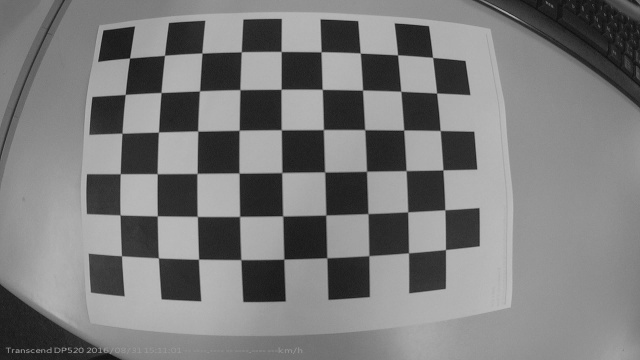

Undistort:

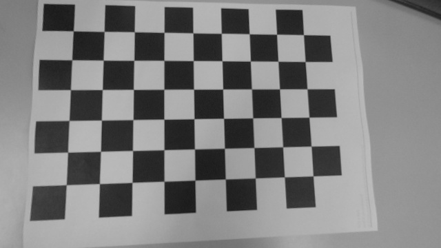

Undistort with new camera matrix:

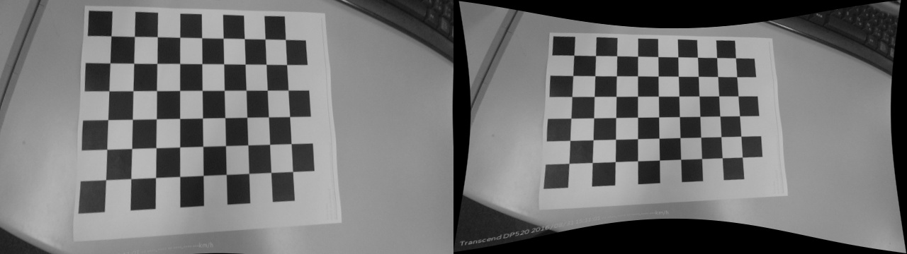

Image source: https://stackoverflow.com/questions/39432322/what-does-the-getoptimalnewcameramatrix-does-in-opencv

Left is 0, Right is 1. (Notice 1 preserves as much pixel information as possible, whereas 0 changes the aspect ratio and FOV.)

```python
img = cv.imread('left12.jpg')
h,  w = img.shape[:2]

# You can scale between 0 and 1!
# 0 : Keep only sensible pixels
# 1 : Keep all original image pixels
newcameramtx, roi = cv.getOptimalNewCameraMatrix(mtx, dist, (w,h), 1, (w,h))

# If you want the asepct ratio to not change, use
newcameramtx, roi = cv.getOptimalNewCameraMatrix(mtx, dist, (w,h), 1, (w,h), centerPrincipalPoint=True)

# The roi returned outlines the good pixel region in the undistorted image
```


#### **Undistortion**

Now we can actually undistort!


```python
# undistort
# If you didn't obtain a new camera matrix, you can just use mtx or leave it empty
# IF empty it'll use mtx
dst = cv.undistort(img, mtx, dist, None, newcameramtx)
# crop the image
x, y, w, h = roi
dst = dst[y:y+h, x:x+w]
cv.imwrite('calibresult.png', dst)
```

Or use remap!

```python
# undistort
mapx, mapy = cv.initUndistortRectifyMap(mtx, dist, None, newcameramtx, (w,h), 5)
dst = cv.remap(img, mapx, mapy, cv.INTER_LINEAR)
# crop the image
x, y, w, h = roi
dst = dst[y:y+h, x:x+w]
cv.imwrite('calibresult.png', dst)
```


#### **Calculate Reprojection Error**

If it's close to zero, great! We've done pretty well!

If not, we might want to recalibrate!

```python
mean_error = 0
for i in xrange(len(objpoints)):
    imgpoints2, _ = cv.projectPoints(objpoints[i], rvecs[i], tvecs[i], mtx, dist)
    error = cv.norm(imgpoints[i], imgpoints2, cv.NORM_L2)/len(imgpoints2)
    mean_error += error
print( "total error: {}".format(mean_error/len(objpoints)) )
```


### Pose Estimation

Woohoo!


```python
# Source: https://docs.opencv.org/3.4.4/d7/d53/tutorial_py_pose.html

import numpy as np
import cv2 as cv
import glob

square_length_mm = 20

# Load calibration parameters
with np.load('B.npz') as X:
    mtx, dist, _, _ = [X[i] for i in ('mtx','dist','rvecs','tvecs')]

def draw(img, corners, imgpts):
    corner = tuple(corners[0].ravel())
    img = cv.line(img, corner, tuple(imgpts[0].ravel()), (255,0,0), 5)
    img = cv.line(img, corner, tuple(imgpts[1].ravel()), (0,255,0), 5)
    img = cv.line(img, corner, tuple(imgpts[2].ravel()), (0,0,255), 5)
    return img

criteria = (cv.TERM_CRITERIA_EPS + cv.TERM_CRITERIA_MAX_ITER, 30, 0.001)
objp = np.zeros((6*7,3), np.float32)
objp[:,:2] = np.mgrid[0:7,0:6].T.reshape(-1,2) * square_length_mm

axis = np.float32([[3,0,0], [0,3,0], [0,0,-3]]).reshape(-1,3) * square_length_mm

# DRAW pose axes!
for fname in glob.glob('left*.jpg'):
    img = cv.imread(fname)
    gray = cv.cvtColor(img,cv.COLOR_BGR2GRAY)
    ret, corners = cv.findChessboardCorners(gray, (7,6),None)

    if ret == True:
        corners2 = cv.cornerSubPix(gray,corners,(11,11),(-1,-1),criteria)

        # Find the rotation and translation vectors.
        ret,rvecs, tvecs = cv.solvePnP(objp, corners2, mtx, dist)
        
        # project 3D points to image plane
        imgpts, jac = cv.projectPoints(axis, rvecs, tvecs, mtx, dist)
        img = draw(img,corners2,imgpts)
        
        cv.imshow('img',img)
        k = cv.waitKey(0) & 0xFF
        if k == ord('s'):
            cv.imwrite(fname[:6]+'.png', img)

cv.destroyAllWindows()
```

**If you want to draw a cube instead**


```python
def draw(img, corners, imgpts):
    imgpts = np.int32(imgpts).reshape(-1,2)
    # draw ground floor in green
    img = cv.drawContours(img, [imgpts[:4]],-1,(0,255,0),-3)
    # draw pillars in blue color
    for i,j in zip(range(4),range(4,8)):
        img = cv.line(img, tuple(imgpts[i]), tuple(imgpts[j]),(255),3)
    # draw top layer in red color
    img = cv.drawContours(img, [imgpts[4:]],-1,(0,0,255),3)
    return img

axis = np.float32([[0,0,0], [0,3,0], [3,3,0], [3,0,0],
                   [0,0,-3],[0,3,-3],[3,3,-3],[3,0,-3] ])
```


#### **Camera Position and Orientation from rvec and tvec**

Source: http://answers.opencv.org/question/161369/retrieve-yaw-pitch-roll-from-rvec/

```python
import math
import numpy as np
import cv2 as cv, cv2

retval, rvec, tvec = cv2.solvePnP(obj_pts, img_pts, cam_mat, dist_coeffs, rvec, tvec, flags=cv2.SOLVEPNP_ITERATIVE)

rmat = cv2.Rodrigues(rvec)[0]

# CAMERA POSITION
cam_pos     = -np.matrix(rmat).T * np.matrix(tvec)

P = np.hstack((rmat,tvec)) # Projection matrix

euler_angles_radians = -cv2.decomposeProjectionMatrix(P)[6]
euler_angles_degrees = 180 * euler_angles_radians/math.pi

eul    = euler_angles_radians
yaw    = 180*eul[1,0]/math.pi # warn: singularity if camera is facing perfectly upward. Value 0 yaw is given by the Y-axis of the world frame.
pitch  = 180*((eul[0,0]+math.pi/2)*math.cos(eul[1,0]))/math.pi
roll   = 180*( (-(math.pi/2)-eul[0,0])*math.sin(eul[1,0]) + eul[2,0] )/math.pi
```


### Depth Map from Stereo Images

Recall again that you can get the pixel focal lengths of the camera from the calibration camera matrix

```python
fx = mtx[0, 0]
fy = mtx[1, 1]
```

Another way to find the focal length: Measure a camera perceived object of known size at a known distance!

*F = (P x  D) / W*

Where:

- F is Focal length
- D is distance of measured object
- P is the pixel height/width of the object
- W is the actual height/width of the object!


Ok! Now we can get to some concepts.


Image source: https://docs.opencv.org/3.4/dd/d53/tutorial_py_depthmap.html

The function we'll be using calculates disparity, which is the difference points x and x'

Disparity = x - x' = Bf / Z

Where:

- B is the distance between the two cameras
- f is the focal length of the camera
- Z is the distance

So Z = Bf / Disparity


You might need to tune the parameters.

| Parameter      | Description                                                  |
| -------------- | ------------------------------------------------------------ |
| numDisparities | the disparity search range. For each pixel algorithm will find the best disparity from 0 (default minimum disparity) to numDisparities. The search range can then be shifted by changing the minimum disparity. |
| blockSize      | the linear size of the blocks compared by the algorithm. The size should be odd (as the block is centered at the current pixel). Larger block size implies smoother, though less accurate disparity map. Smaller block size gives more detailed disparity map, but there is higher chance for algorithm to find a wrong correspondence. |

```python
stereo_computer = cv.StereoBM_create([, numDisparities[, blockSize]])
```

The stereoBM also has a couple of hidden parameters

Just run `dir(stereo_computer)` to find the proper methods to get and set them.

- **texture_threshold:** filters out areas that don't have enough texture for reliable matching
- **Speckle range and size**: Block-based matchers often produce "speckles" near the boundaries of objects, where the matching window catches the foreground on one side and the background on the other. In this scene it appears that the matcher is also finding small spurious matches in the projected texture on the table. To get rid of these artifacts we post-process the disparity image with a speckle filter controlled by the speckle_size and speckle_range parameters. speckle_size is the number of pixels below which a disparity blob is dismissed as "speckle." speckle_range controls how close in value disparities must be to be considered part of the same blob.
- **Number of disparities**: How many pixels to slide the window over. The larger it is, the larger the range of visible depths, but more computation is required.
- **min_disparity**: the offset from the x-position of the left pixel at which to begin searching.
- **uniqueness_ratio**: Another post-filtering step. If the best matching disparity is not sufficiently better than every other disparity in the search range, the pixel is filtered out. You can try tweaking this if texture_threshold and the speckle filtering are still letting through spurious matches.
- **prefilter_size** and **prefilter_cap**: The pre-filtering phase, which normalizes image brightness and enhances texture in preparation for block matching. Normally you should not need to adjust these.

**Try it out!**


```python
# Source: https://docs.opencv.org/3.4/dd/d53/tutorial_py_depthmap.html

import numpy as np
import cv2 as cv
from matplotlib import pyplot as plt

imgL = cv.imread('tsukuba_l.png',0)
imgR = cv.imread('tsukuba_r.png',0)

stereo = cv.StereoBM_create(numDisparities=16, blockSize=15)
disparity = stereo.compute(imgL,imgR)

plt.imshow(disparity,'gray')
plt.show()
```


## 3. Object Tracking

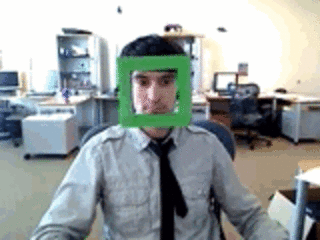

Silliness from: https://www.learnopencv.com/object-tracking-using-opencv-cpp-python/


### Meanshift

Meanshift is a very primitive way to track objects in videos.

A meanshift tracker can be thought of as an object that, within a set window of moving, moves towards an area of maximum pixel density.

So in the case of object tracking, you track the next frame of the video, but backproject the histogram of the initial window you're looking at onto that frame first. You'll usually have the area of greatest pixel density then be the area in the frame that looks most like the area you were tracking in the initial frame! Nifty!

You COULD also iteratively recalculate the histogram of the preceding frame's ROI, but your mileage may vary.

Course, this algorithm isn't really robust to scaling or rotation since the window doesn't rotate or scale. But it's a good start.


Image source: https://docs.opencv.org/3.4.4/db/df8/tutorial_py_meanshift.html

| Parameter | Description                                                  |
| --------- | ------------------------------------------------------------ |
| probImage | Back projection of the object histogram. See calcBackProject for details. |
| window    | Initial search window.                                       |
| criteria  | Stop criteria for the iterative search algorithm. returns : Number of iterations CAMSHIFT took to converge. The function implements the iterative object search algorithm. It takes the input back projection of an object and the initial position. The mass center in window of the back projection image is computed and the search window center shifts to the mass center. The procedure is repeated until the specified number of iterations criteria.maxCount is done or until the window center shifts by less than criteria.epsilon. The algorithm is used inside CamShift and, unlike CamShift , the search window size or orientation do not change during the search. You can simply pass the output of calcBackProject to this function. But better results can be obtained if you pre-filter the back projection and remove the noise. For example, you can do this by retrieving connected components with findContours , throwing away contours with small area ( contourArea ), and rendering the remaining contours with drawContours. |

```python
retval, window = cv.meanShift(probImage, window, criteria)
```

**Try it out!**


Image source: https://docs.opencv.org/3.4.4/db/df8/tutorial_py_meanshift.html

```python
# Source: https://docs.opencv.org/3.4.4/db/df8/tutorial_py_meanshift.html

import numpy as np
import cv2 as cv
cap = cv.VideoCapture('slow.flv')

# take first frame of the video
ret,frame = cap.read()

# setup initial location of window
r,h,c,w = 250,90,400,125  # simply hardcoded the values
track_window = (c,r,w,h)

# set up the ROI for tracking
roi = frame[r:r+h, c:c+w]
hsv_roi =  cv.cvtColor(roi, cv.COLOR_BGR2HSV)
mask = cv.inRange(hsv_roi, np.array((0., 60.,32.)), np.array((180.,255.,255.)))
roi_hist = cv.calcHist([hsv_roi],[0],mask,[180],[0,180])
cv.normalize(roi_hist,roi_hist,0,255,cv.NORM_MINMAX)

# Setup the termination criteria, either 10 iteration or move by atleast 1 pt
term_crit = (cv.TERM_CRITERIA_EPS | cv.TERM_CRITERIA_COUNT, 10, 1)

while(1):
    ret ,frame = cap.read()
    if ret == True:
        hsv = cv.cvtColor(frame, cv.COLOR_BGR2HSV)
        dst = cv.calcBackProject([hsv],[0],roi_hist,[0,180],1)

        # apply meanshift to get the new location
        ret, track_window = cv.meanShift(dst, track_window, term_crit)
        
        # Draw it on image
        x,y,w,h = track_window
        img2 = cv.rectangle(frame, (x,y), (x+w,y+h), 255,2)
        
        cv.imshow('img2',img2)
        k = cv.waitKey(60) & 0xff
        
        if k == 27:
            break
        else:
            cv.imwrite(chr(k)+".jpg",img2)
    else:
        break

        cv.destroyAllWindows()
cap.release()
```


### Camshift

Continuously Adaptive Meanshift

Just like meanshift, but fixing the scaling and rotation problems!


Image source: https://docs.opencv.org/3.4.4/db/df8/tutorial_py_meanshift.html

| Parameter | Description                                                  |
| --------- | ------------------------------------------------------------ |
| probImage | Back projection of the object histogram. See calcBackProject. |
| window    | Initial search window.                                       |
| criteria  | Stop criteria for the underlying meanShift. returns (in old interfaces) Number of iterations CAMSHIFT took to converge The function implements the CAMSHIFT object tracking algorithm [[25\]](https://docs.opencv.org/3.4.4/d0/de3/citelist.html#CITEREF_Bradski98) . First, it finds an object center using meanShift and then adjusts the window size and finds the optimal rotation. The function returns the rotated rectangle structure that includes the object position, size, and orientation. The next position of the search window can be obtained with [RotatedRect::boundingRect()](https://docs.opencv.org/3.4.4/db/dd6/classcv_1_1RotatedRect.html#a055a5d35e50bce65e3b1dee318dd3044) |

```python
retval, window = cv.CamShift(probImage, window, criteria)
```

**Try it out!**


Image source: https://docs.opencv.org/3.4.4/db/df8/tutorial_py_meanshift.html

```python
# Source: https://docs.opencv.org/3.4.4/db/df8/tutorial_py_meanshift.html

import numpy as np
import cv2 as cv

cap = cv.VideoCapture('slow.flv')

# take first frame of the video
ret,frame = cap.read()

# setup initial location of window
r,h,c,w = 250,90,400,125  # simply hardcoded the values
track_window = (c,r,w,h)

# set up the ROI for tracking
roi = frame[r:r+h, c:c+w]
hsv_roi =  cv.cvtColor(roi, cv.COLOR_BGR2HSV)
mask = cv.inRange(hsv_roi, np.array((0., 60.,32.)), np.array((180.,255.,255.)))

roi_hist = cv.calcHist([hsv_roi],[0],mask,[180],[0,180])
cv.normalize(roi_hist,roi_hist,0,255,cv.NORM_MINMAX)

# Setup the termination criteria, either 10 iteration or move by atleast 1 pt
term_crit = ( cv.TERM_CRITERIA_EPS | cv.TERM_CRITERIA_COUNT, 10, 1 )

while(1):
    ret ,frame = cap.read()
    
    if ret == True:
        hsv = cv.cvtColor(frame, cv.COLOR_BGR2HSV)
        dst = cv.calcBackProject([hsv],[0],roi_hist,[0,180],1)

        # apply meanshift to get the new location
        ret, track_window = cv.CamShift(dst, track_window, term_crit)
        
        # Draw it on image
        pts = cv.boxPoints(ret)
        pts = np.int0(pts)
        img2 = cv.polylines(frame,[pts],True, 255,2)
        
        cv.imshow('img2',img2)
        
        k = cv.waitKey(60) & 0xff
        
        if k == 27:
            break
        else:
            cv.imwrite(chr(k)+".jpg",img2)
    else:
        break

        cv.destroyAllWindows()
cap.release()
```


### Centroid Tracking

PyImageSearch also created a pretty nifty Centroid Tracker that registers object IDs!

You can find it here: https://www.pyimagesearch.com/2018/07/23/simple-object-tracking-with-opencv/

The code for it can also be found in `Resources/people-counting-opencv/pyimagesearch/centroidtracker.py`

or `PyImageSearch Utils`

**Note that it doesn't technically track everytime. It only tracks when you update it!** The main purpose of this tracker is to attach IDs to objects and ONLY updates if passed a detection bounding box!

Demo: https://www.youtube.com/watch?v=H0ztMWR3C04

The algorithm for it is:

- Get bounding boxes of detected objects and compute centroids

  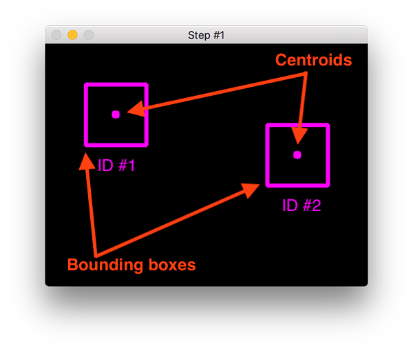

- Compute euclidean distance between new bounding boxes and existing objects
  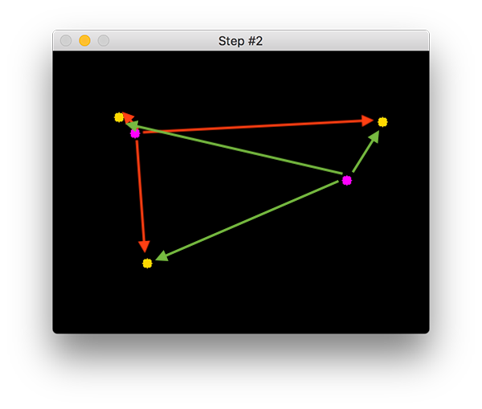

- Update x,y coordinates of existing objects
  

- Register new objects
  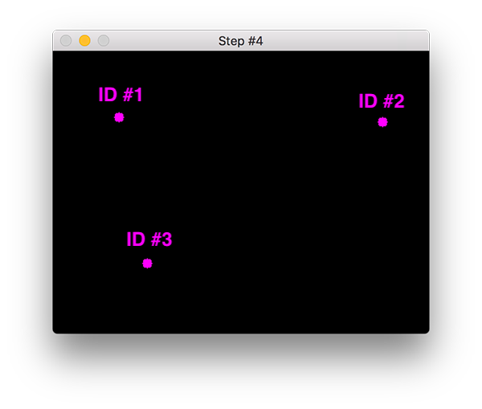

- Deregister old objects


**Usage**

```python
# Instantiate the tracker
ct = CentroidTracker()

# Update bounding boxes
# That's it! All the registering, tracking, etc, is all handled internally. Pretty nifty.
objects = ct.update(bounding_boxes)

# If you want you can draw the bounding boxes with IDs on them.
for (objectID, centroid) in objects.items():
		# draw both the ID of the object and the centroid of the
		# object on the output frame
		text = "ID {}".format(objectID)
		cv2.putText(frame, text, (centroid[0] - 10, centroid[1] - 10),
			cv2.FONT_HERSHEY_SIMPLEX, 0.5, (0, 255, 0), 2)
		cv2.circle(frame, (centroid[0], centroid[1]), 4, (0, 255, 0), -1)
```


### Single Object Tracking

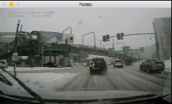

Image source: https://www.pyimagesearch.com/2018/07/30/opencv-object-tracking/

OpenCV has 8 different object tracking implementations that you can use!

Trackers are useful because they're NOT detectors, and so are less computationally intensive.

> 1. **BOOSTING Tracker:** Based on the same algorithm used to power the machine learning behind Haar cascades (AdaBoost), but like Haar cascades, is over a decade old. This tracker is slow and doesn’t work very well. Interesting only for legacy reasons and comparing other algorithms. *(minimum OpenCV 3.0.0)*
> 2. **MIL Tracker:** Better accuracy than BOOSTING tracker but does a poor job of reporting failure. *(minimum OpenCV 3.0.0)*
> 3. **KCF Tracker:** Kernelized Correlation Filters. Faster than BOOSTING and MIL. Similar to MIL and KCF, does not handle full occlusion well. *(minimum OpenCV 3.1.0)*
> 4. **CSRT Tracker:** Discriminative Correlation Filter (with Channel and Spatial Reliability). Tends to be more accurate than KCF but slightly slower. *(minimum OpenCV 3.4.2)*
> 5. **MedianFlow Tracker:** Does a nice job reporting failures; however, if there is too large of a jump in motion, such as fast moving objects, or objects that change quickly in their appearance, the model will fail. *(minimum OpenCV 3.0.0)*
> 6. **TLD Tracker:** I’m not sure if there is a problem with the OpenCV implementation of the TLD tracker or the actual algorithm itself, but the TLD tracker was incredibly prone to false-positives. I do not recommend using this OpenCV object tracker. *(minimum OpenCV 3.0.0)*
> 7. **MOSSE Tracker:** Very, *very* fast. Not as accurate as CSRT or KCF but a good choice if you need pure speed. *(minimum OpenCV 3.4.1)*
> 8. **GOTURN Tracker:** The only deep learning-based object detector included in OpenCV. It requires additional model files to run (will not be covered in this post). My initial experiments showed it was a bit of a pain to use even though it reportedly handles viewing changes well (my initial experiments didn’t confirm this though). I’ll try to cover it in a future post, but in the meantime, take a look at [Satya’s writeup](https://www.learnopencv.com/goturn-deep-learning-based-object-tracking/). *(minimum OpenCV 3.2.0)*
>
> **My personal suggestion is to:**
>
> - Use CSRT when you need **higher object tracking accuracy and can tolerate slower FPS throughput**
> - Use KCF when you need **faster FPS throughput** but can **handle slightly lower object tracking accuracy**
> - Use **MOSSE when you need pure speed**
>
> https://www.pyimagesearch.com/2018/07/30/opencv-object-tracking/

More info: https://www.learnopencv.com/object-tracking-using-opencv-cpp-python/

```python
# Create the specific tracker you want

OPENCV_OBJECT_TRACKERS = {"csrt": cv2.TrackerCSRT_create,
                          "kcf": cv2.TrackerKCF_create,
                          "boosting": cv2.TrackerBoosting_create,
                          "mil": cv2.TrackerMIL_create,
                          "tld": cv2.TrackerTLD_create,
                          "medianflow": cv2.TrackerMedianFlow_create,
                          "mosse": cv2.TrackerMOSSE_create}
 
tracker = OPENCV_OBJECT_TRACKERS["TRACKER YOU WANT!"]()

# Init the tracker with a bounding box from an object detector
tracker.init(img, bounding_box)

# Then just keep updating it!
# You are advised to reinitialise every now and again with your feature or object detectors to keep the trackers fresh!
# If you reinitialise and it still doesn't work, delete and recreate the tracker!
(success, new_bounding_box) = tracker.update(next_frame)
```

After you do your tracking, you can find the bounding_box centroids and draw ghostlines to make things look pretty!


### Multi-object Tracking

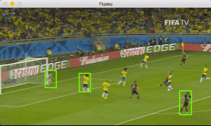

Image source: https://www.pyimagesearch.com/2018/08/06/tracking-multiple-objects-with-opencv/

Note: This implementation is still single core. You'll need to parallelise if you want pipeline speedups.

```python
# OpenCV has a multi-object tracker convenience object
trackers = cv2.MultiTracker_create()

# Add your trackers to this multi-object tracker!
# I'm assuming you've instantiated a tracker from the previous section
# Do not init the tracker, simply create it
trackers.add(tracker, frame, bounding_box)

# Now you can run update as usual!
(success, bounding_boxes) = trackers.update(frame)

# Sadly there's no way to reinit individual trackers, so you're advised to reinit the entire thing

# Alternatively, don't use this interface at all and use your trackers separately.
```


### dlib: Single Object Tracking

dlib's tracker is a correlation tracker!

Note: dlib rectangles are `rect(left, top, right, bottom)`

To convert openCV rectangles to dlib ones, simply use

`left, top, right, bottom = rect.x , rect.y, rect.x + rect.width, rect.y + rect.width`


Image source: https://www.pyimagesearch.com/2018/10/22/object-tracking-with-dlib/

```python
# Create tracker
tracker = dlib.correlation_tracker()

# Init tracker
rect = dlib.rectangle(startX, startY, endX, endY)
tracker.start_track(rgb, rect)

# Update tracker and get position
tracker.update(rgb)
pos = tracker.get_position()

# unpack the position object
startX = int(pos.left())
startY = int(pos.top())
endX = int(pos.right())
endY = int(pos.bottom())
 
```

**Drawbacks and Improvements**

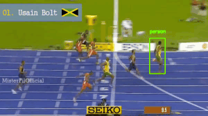

Image source: https://www.pyimagesearch.com/2018/10/22/object-tracking-with-dlib/

Since it's a correlation tracker, if the object changes too much or gets occluded the tracker will lose the object.

To fix this, just occasionally run the object detection and reinit the tracker! You can even choose to just run object detection on a small ROI encompassing the neighbouring area of the last position of the tracker to get even more speed improvements if all you wanted to do was track a single specific object!


### dlib: Multi-object Tracking

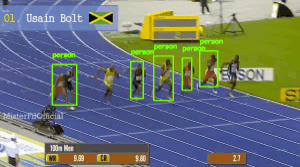

Image source: https://www.pyimagesearch.com/2018/10/29/multi-object-tracking-with-dlib/

Easy! Just make a list of the trackers...

You could also append the label of the thing you're tracking.

```python
t = dlib.correlation_tracker()
rect = dlib.rectangle(startX, startY, endX, endY)
t.start_track(rgb, rect)

# update our set of trackers and corresponding class
# labels
labels.append(label)
trackers.append(t)

for (t, l) in zip(trackers, labels):
    # update the tracker and grab the position of the tracked
    # object
    t.update(rgb)
    pos = t.get_position()

    # unpack the position object
    startX = int(pos.left())
    startY = int(pos.top())
    endX = int(pos.right())
    endY = int(pos.bottom())

    # draw the bounding box from the correlation object tracker
    cv2.rectangle(frame, (startX, startY), (endX, endY),
                  (0, 255, 0), 2)
    cv2.putText(frame, l, (startX, startY - 15),
                cv2.FONT_HERSHEY_SIMPLEX, 0.45, (0, 255, 0), 2)
```


### dlib: Multi-Object Tracking with Multiprocessing

https://www.pyimagesearch.com/2018/10/29/multi-object-tracking-with-dlib/

Note: I made some small edits to the PyImageSearch implementation. CH3EERS!

This implementation kills the process if the tracker misses 50 consecutive frames.

It'll also put a None in the output queue so the external queue can be popped.

```python
def start_tracker(box, label, rgb, inputQueue, outputQueue):
	# construct a dlib rectangle object from the bounding box
	# coordinates and then start the correlation tracker
	t = dlib.correlation_tracker()
	rect = dlib.rectangle(box[0], box[1], box[2], box[3])
	t.start_track(rgb, rect)
    
    lost_track_count = 0
	
	# loop indefinitely -- this function will be called as a daemon
	# process so we don't need to worry about joining it
	while True:
		# attempt to grab the next frame from the input queue
		rgb = inputQueue.get()
 
		# if there was an entry in our queue, process it
		if rgb is not None:
			# update the tracker and grab the position of the tracked
			# object
			t.update(rgb)
			pos = t.get_position()
 
            if pos is None:
                lost_track_count += 1
            
                if lost_track_count > 50:
                    outputQueue.put(None)
                    
                    return

			# unpack the position object
			startX = int(pos.left())
			startY = int(pos.top())
			endX = int(pos.right())
			endY = int(pos.bottom())
 
			# add the label + bounding box coordinates to the output
			# queue
			outputQueue.put((label, (startX, startY, endX, endY)))
```

**Starting new trackers**

```python
# create two brand new input and output queues,
# respectively
iq = multiprocessing.Queue()
oq = multiprocessing.Queue()
inputQueues.append(iq)
outputQueues.append(oq)

# spawn a daemon process for a new object tracker
p = multiprocessing.Process(
    target=start_tracker,
    args=(bb, label, rgb, iq, oq))
p.daemon = True
p.start()
```

**Processing new frames**

```python
# loop over each of our input ques and add the input RGB
# frame to it, enabling us to update each of the respective
# object trackers running in separate processes
for iq in inputQueues:
    iq.put(rgb)

# loop over each of the output queues
for oq in outputQueues:
    # grab the updated bounding box coordinates for the
    # object -- the .get method is a blocking operation so
    # this will pause our execution until the respective
    # process finishes the tracking update
    try:
        tracked_box = oq.get()
        
        # If the tracker lost the object, delete the relevant queues
        if tracked_box is None:
            idx = outputQueues.index(oq)
            del outputQueues[idx]
            del inputQueues[idx]
        else:
            (label, (startX, startY, endX, endY)) = tracked_box
    except:
        continue
            
    # draw the bounding box from the correlation object
    # tracker
    cv2.rectangle(frame, (startX, startY), (endX, endY),
                  (0, 255, 0), 2)
    cv2.putText(frame, label, (startX, startY - 15),
                cv2.FONT_HERSHEY_SIMPLEX, 0.45, (0, 255, 0), 2)
```


### Footfall Tracking

Source: https://www.pyimagesearch.com/2018/08/13/opencv-people-counter/

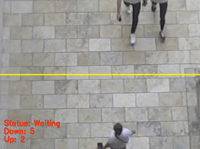

Steps:

- Run detectors
- Track detected objects
- If detected objects are people append IDs to them, and if the people have not been counted before:
  - If the people's centroids are moving up and are above the top half of the image, increment up
  - If the people's centroids are moving down and are above the bottom half of the image, increment down

Check the code in people-counting-opencv in the Resources folder.


```
                            .     .
                         .  |\-^-/|  .    
                        /| } O.=.O { |\
```

​    

------

 [.png)](https://www.buymeacoffee.com/methylDragon)

