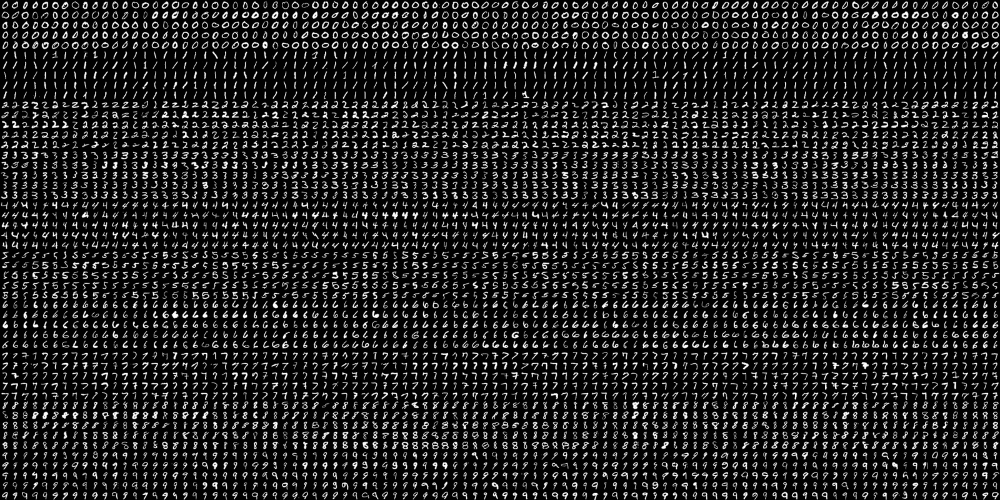
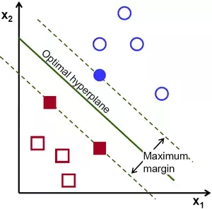
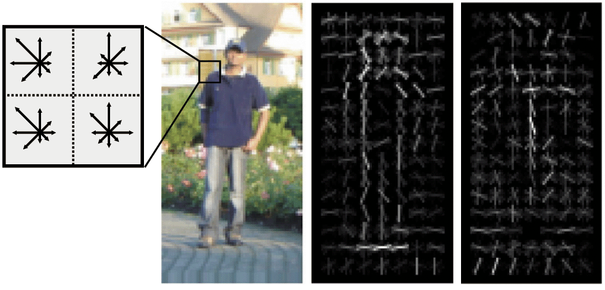
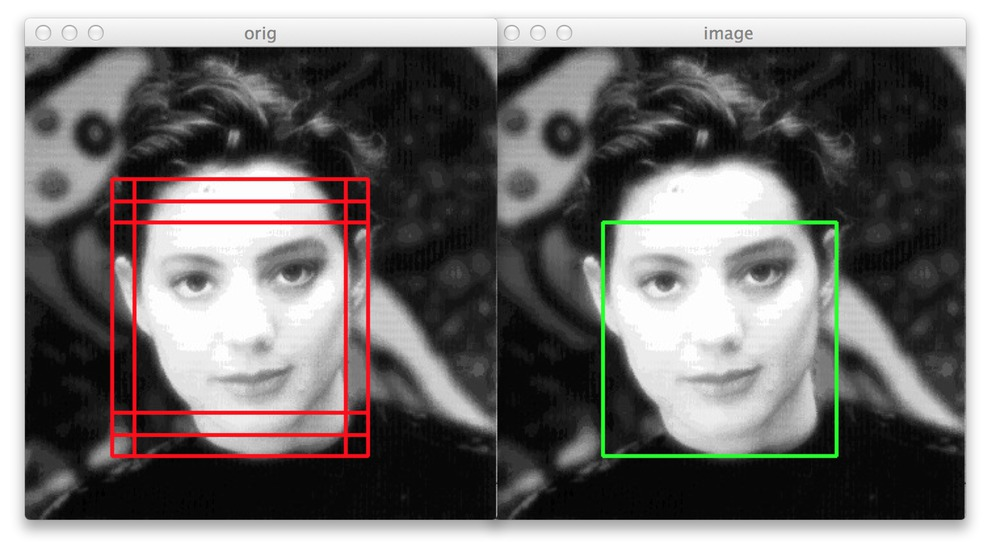
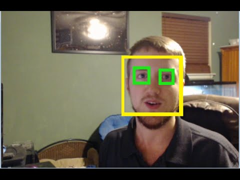
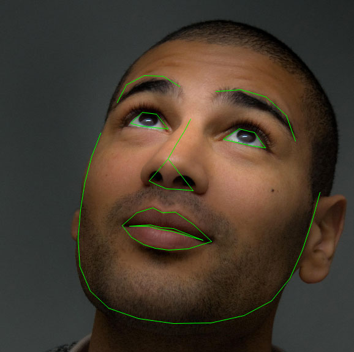
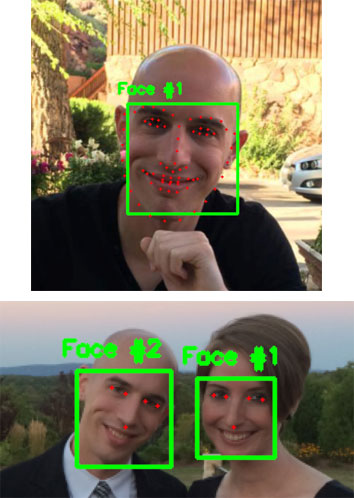
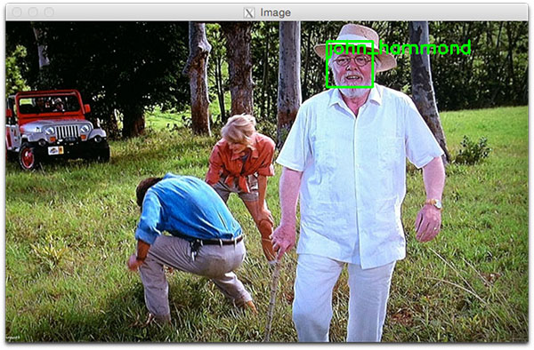
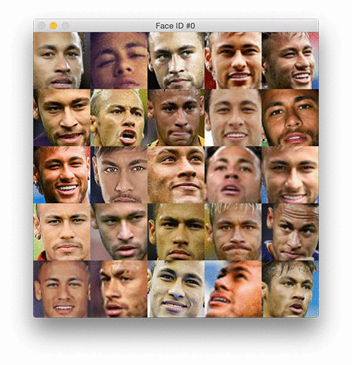

# OpenCV Python Machine Learning and AI Detector Cheatsheet

Author: methylDragon  
Contains a syntax reference and code snippets for OpenCV for Python!  
Note that this document is more or less based on the tutorials on https://docs.opencv.org    
With some personal notes from me!    

------

## Pre-Requisites

### Required

- Python knowledge, this isn't a tutorial!
- OpenCV installed


## 1. Introduction

Not much of an introduction here. OpenCV is just really great!

Since this is a work in progress, it's not going to be very well organised.

```python
# These will have been assumed to have been run

import cv2 as cv2, cv
import numpy as np
```

If you need additional help or need a refresher on the parameters, feel free to use:

```python
help(cv.FUNCTION_YOU_NEED_HELP_WITH)
```


## 2. Machine Learning

You'd expect ML tools to be part of dependencies like sklearn, but it appears OpenCV has some dedicated ML functions too!

### k-Nearest Neighbours

Given known clusters of labelled data, decide the best class to classify a new piece of data as.


So check for the nearest neighbours, and weight the importance by how close the neighbours are to the new data point under some cost function.

**Try it out!**

```python
# Source: https://docs.opencv.org/3.4.4/d5/d26/tutorial_py_knn_understanding.html

import cv2 as cv
import numpy as np
import matplotlib.pyplot as plt

# Feature set containing (x,y) values of 25 known/training data
trainData = np.random.randint(0,100,(25,2)).astype(np.float32)

# Labels each one either Red or Blue with numbers 0 and 1
responses = np.random.randint(0,2,(25,1)).astype(np.float32)

# Take Red families and plot them
red = trainData[responses.ravel()==0]
plt.scatter(red[:,0],red[:,1],80,'r','^')

# Take Blue families and plot them
blue = trainData[responses.ravel()==1]
plt.scatter(blue[:,0],blue[:,1],80,'b','s')
plt.show()

newcomer = np.random.randint(0,100,(1,2)).astype(np.float32)
plt.scatter(newcomer[:,0],newcomer[:,1],80,'g','o')

# HERE WE GO!
knn = cv.ml.KNearest_create()
knn.train(trainData, cv.ml.ROW_SAMPLE, responses)

# You can change the algorithm type if you wish
# knn.setAlgorithmType(cv.ml.KNearest_BRUTE_FORCE)
# knn.setAlgorithmType(cv.ml.KNearest_KDTREE)

ret, results, neighbours ,dist = knn.findNearest(newcomer, 3)

print( "result:  {}\n".format(results) ) # Index of the label that was assigned
print( "neighbours:  {}\n".format(neighbours) )
print( "distance:  {}\n".format(dist) )

plt.show()
```

**You can also do it as an array**

```python
# 10 new comers
newcomers = np.random.randint(0,100,(10,2)).astype(np.float32)
ret, results,neighbours,dist = knn.findNearest(newcomer, 3)
# The results also will contain 10 labels.
```


### OCR with k-Nearest Neighbours

So what did we go through kNN? Turns out you can use it to build a super basic OCR application!

OpenCV has an image of 5000 digits in `/opencv/samples/data` called digits.png. We can use this as a training dataset.

It's basically rows upon rows of 0, 1, 2, 3, 4... digits.



```python
# Source: https://docs.opencv.org/3.4.4/d8/d4b/tutorial_py_knn_opencv.html

import numpy as np
import cv2 as cv
from matplotlib import pyplot as plt

img = cv.imread('digits.png')
gray = cv.cvtColor(img,cv.COLOR_BGR2GRAY)

# Now we split the image to 5000 cells, each 20x20 size
cells = [np.hsplit(row,100) for row in np.vsplit(gray,50)]

# Make it into a Numpy array. It size will be (50,100,20,20)
x = np.array(cells)

# Now we prepare train_data and test_data.
train = x[:,:50].reshape(-1,400).astype(np.float32) # Size = (2500,400)
test = x[:,50:100].reshape(-1,400).astype(np.float32) # Size = (2500,400)

# Create labels for train and test data
k = np.arange(10)
train_labels = np.repeat(k,250)[:,np.newaxis]
test_labels = train_labels.copy()

# You can decide to save the data if you wish
# np.savez('digit_dataset.npz', train=train, test=test, train_labels=train_labels, test_labels=test_labels)

# Initiate kNN, train the data, then test it with test data for k=1
knn = cv.ml.KNearest_create()
knn.train(train, cv.ml.ROW_SAMPLE, train_labels)

# At this point you could potentially pickle the knn classifier

ret,result,neighbours,dist = knn.findNearest(test,k=5)

# Now we check the accuracy of classification
# For that, compare the result with test_labels and check which are wrong
matches = result==test_labels
correct = np.count_nonzero(matches)
accuracy = correct*100.0/result.size

print( accuracy )
```


**You can also do letter OCR too!**

> Next we will do the same for English alphabets, but there is a slight change in data and feature set. Here, instead of images, OpenCV comes with a data file, letter-recognition.data in opencv/samples/cpp/ folder. If you open it, you will see 20000 lines which may, on first sight, look like garbage. Actually, in each row, first column is an alphabet which is our label. Next 16 numbers following it are its different features. These features are obtained from [UCI Machine Learning Repository](http://archive.ics.uci.edu/ml/). You can find the details of these features in [this page](http://archive.ics.uci.edu/ml/datasets/Letter+Recognition).
>
> https://docs.opencv.org/3.4.4/d8/d4b/tutorial_py_knn_opencv.html

```python
# Source: https://docs.opencv.org/3.4.4/d8/d4b/tutorial_py_knn_opencv.html

import cv2 as cv
import numpy as np
import matplotlib.pyplot as plt

# Load the data, converters convert the letter to a number
data= np.loadtxt('letter-recognition.data', dtype= 'float32', delimiter = ',',
                    converters= {0: lambda ch: ord(ch)-ord('A')})

# split the data to two, 10000 each for train and test
train, test = np.vsplit(data,2)

# split trainData and testData to features and responses
responses, trainData = np.hsplit(train,[1])
labels, testData = np.hsplit(test,[1])

# Initiate the kNN, classify, measure accuracy.
knn = cv.ml.KNearest_create()
knn.train(trainData, cv.ml.ROW_SAMPLE, responses)

ret, result, neighbours, dist = knn.findNearest(testData, k=5)
correct = np.count_nonzero(result == labels)

accuracy = correct*100.0/10000
print( accuracy )
```


### K-Means Clustering

It's unsupervised! The clusterer will split the data into K means which you can specify.


#### **Concept**

Source: https://docs.opencv.org/3.4.4/de/d4d/tutorial_py_kmeans_understanding.html

Algorithm:


- **Step : 1** - Algorithm randomly chooses two centroids, C1 and C2 (sometimes, any two data are taken as the centroids).

  

- **Step : 2** - It calculates the distance from each point to both centroids. If a test data is more closer to C1, then that data is labelled with '0'. If it is closer to C2, then labelled as '1' (If more centroids are there, labelled as '2','3' etc).

- **Step : 3** - Next we calculate the average of all blue points and red points separately and that will be our new centroids. That is C1 and C2 shift to newly calculated centroids. (Remember, the images shown are not true values and not to true scale, it is just for demonstration only).

  

- Now **Step - 2** and **Step - 3** are iterated until both centroids are converged to fixed points. *(Or it may be stopped depending on the criteria we provide, like maximum number of iterations, or a specific accuracy is reached etc.)* **These points are such that sum of distances between test data and their corresponding centroids are minimum**. Or simply, sum of distances between C1↔Red_Points and C2↔Blue_Points is minimum.

  


#### **Usage**

Source: https://docs.opencv.org/3.4.4/d1/d5c/tutorial_py_kmeans_opencv.html

**Input parameters**

1. **samples** : It should be of **np.float32** data type, and each feature should be put in a single column.
2. **nclusters(K)** : Number of clusters required at end
3. criteria: Iteration termination criteria. When this criteria is satisfied, algorithm iteration stops. Actually, it should be a tuple of 3 parameters. They are `( type, max_iter, epsilon )`:
   1. type of termination criteria. It has 3 flags as below:
      - **cv.TERM_CRITERIA_EPS** - stop the algorithm iteration if specified accuracy, *epsilon*, is reached.
      - **cv.TERM_CRITERIA_MAX_ITER** - stop the algorithm after the specified number of iterations, *max_iter*.
      - **cv.TERM_CRITERIA_EPS + cv.TERM_CRITERIA_MAX_ITER** - stop the iteration when any of the above condition is met.
   2. max_iter - An integer specifying maximum number of iterations.
   3. epsilon - Required accuracy
4. **attempts** : Flag to specify the number of times the algorithm is executed using different initial labellings. The algorithm returns the labels that yield the best compactness. This compactness is returned as output.
5. **flags** : This flag is used to specify how initial centers are taken. Normally two flags are used for this : **cv.KMEANS_PP_CENTERS** and **cv.KMEANS_RANDOM_CENTERS**.

**Output parameters**

1. **compactness** : It is the sum of squared distance from each point to their corresponding centers.
2. **labels** : This is the label array (same as 'code' in previous article) where each element marked '0', '1'.....
3. **centers** : This is array of centers of clusters.

```python
retval, bestLabels, centers = cv.kmeans(data, K, bestLabels, criteria,
                                        attempts, flags[, centers)
```


#### **One-dimensional Data Example**


```python
# Source: https://docs.opencv.org/3.4.4/d1/d5c/tutorial_py_kmeans_opencv.html

import numpy as np
import cv2 as cv
from matplotlib import pyplot as plt

x = np.random.randint(25,100,25)
y = np.random.randint(175,255,25)

z = np.hstack((x,y))
z = z.reshape((50,1))
z = np.float32(z)

plt.hist(z,256,[0,256]),plt.show()

# Define criteria = ( type, max_iter = 10 , epsilon = 1.0 )
criteria = (cv.TERM_CRITERIA_EPS + cv.TERM_CRITERIA_MAX_ITER, 10, 1.0)

# Set flags (Just to avoid line break in the code)
flags = cv.KMEANS_RANDOM_CENTERS

# Apply KMeans
compactness,labels,centers = cv.kmeans(z,2,None,criteria,10,flags)

A = z[labels==0]
B = z[labels==1]

# Now plot 'A' in red, 'B' in blue, 'centers' in yellow
plt.hist(A,256,[0,256],color = 'r')
plt.hist(B,256,[0,256],color = 'b')
plt.hist(centers,32,[0,256],color = 'y')

plt.show()
```


#### **Multi-dimensional Data Example**

Remember! Place each feature in its own column as such:


```python
# Source: https://docs.opencv.org/3.4.4/d1/d5c/tutorial_py_kmeans_opencv.html

import numpy as np
import cv2 as cv
from matplotlib import pyplot as plt

X = np.random.randint(25,50,(25,2))
Y = np.random.randint(60,85,(25,2))
Z = np.vstack((X,Y))

# convert to np.float32
Z = np.float32(Z)

# define criteria and apply kmeans()
criteria = (cv.TERM_CRITERIA_EPS + cv.TERM_CRITERIA_MAX_ITER, 10, 1.0)
ret,label,center=cv.kmeans(Z,2,None,criteria,10,cv.KMEANS_RANDOM_CENTERS)

# Now separate the data, Note the flatten()
A = Z[label.ravel()==0]
B = Z[label.ravel()==1]

# Plot the data
plt.scatter(A[:,0],A[:,1])
plt.scatter(B[:,0],B[:,1],c = 'r')
plt.scatter(center[:,0],center[:,1],s = 80,c = 'y', marker = 's')
plt.xlabel('Height'),plt.ylabel('Weight')

plt.show()
```


### Colour Quantisation Using K-Means Clustering

Reduce the number of colors in an image to save memory!


```python
# Source: https://docs.opencv.org/3.4.4/d1/d5c/tutorial_py_kmeans_opencv.html

import numpy as np
import cv2 as cv

img = cv.imread('home.jpg')
Z = img.reshape((-1,3))

# convert to np.float32
Z = np.float32(Z)

# define criteria, number of clusters(K) and apply kmeans()
criteria = (cv.TERM_CRITERIA_EPS + cv.TERM_CRITERIA_MAX_ITER, 10, 1.0)
K = 8
ret,label,center=cv.kmeans(Z,K,None,criteria,10,cv.KMEANS_RANDOM_CENTERS)

# Now convert back into uint8, and make original image
center = np.uint8(center)
res = center[label.flatten()]
res2 = res.reshape((img.shape))

cv.imshow('res2',res2)
cv.waitKey(0)
cv.destroyAllWindows()
```


### Support Vector Machines

#### **Concept**

THIS VIDEO IS VERY GOOD: https://www.youtube.com/watch?v=-Z4aojJ-pdg

1. Pick the optimal n-th dimensional hyperplane that best separates your two classes

   - You want to minimise misclassifications.
     
     Notice in this example, the filled data points are the only ones that matter. SVMs allow you to use only a subset of your data so they're cheaper to train! Though note that because of this data prone to error messes up the SVM optimisation.

2. In the event where your data is not linearly separable, utilise the **kernel trick**. That is, pull your data up into a higher dimension so you're able to slice through it with a single hyperplane! Calculating this kernel isn't so fast though, so training a large dataset will be expensive.

   

Basically, SVMs try to find the best way to slice your data to classify it properly!


### OCR with Support Vector Machines

In the k-Nearest Neighbours OCR example, pixel intensity was used as a feature. But in this SVM example, the feature will be the Histogram of Oriented Gradients.



Ok. Step one.

**We need to deskew our images.**


Right is deskewed.

```python
# Source: https://docs.opencv.org/3.4.4/dd/d3b/tutorial_py_svm_opencv.html

# SZ here will be found in the full implementation below (it stands for side size)

def deskew(img):
    m = cv.moments(img)
    
    if abs(m['mu02']) < 1e-2:
        return img.copy()
    
    skew = m['mu11']/m['mu02']
    M = np.float32([[1, skew, -0.5*SZ*skew], [0, 1, 0]])
    img = cv.warpAffine(img,M,(SZ, SZ),flags=affine_flags)
    
    return img
```

**Then we need to obtain our HoG descriptors**

```python
def hog(img):
    gx = cv.Sobel(img, cv.CV_32F, 1, 0)
    gy = cv.Sobel(img, cv.CV_32F, 0, 1)
    
    mag, ang = cv.cartToPolar(gx, gy)
    
    bins = np.int32(bin_n*ang/(2*np.pi))    # quantizing binvalues in (0...16)
    bin_cells = bins[:10,:10], bins[10:,:10], bins[:10,10:], bins[10:,10:]
    mag_cells = mag[:10,:10], mag[10:,:10], mag[:10,10:], mag[10:,10:]
    
    hists = [np.bincount(b.ravel(), m.ravel(), bin_n) for b, m in zip(bin_cells, mag_cells)]
    hist = np.hstack(hists)     # hist is a 64 bit vector

    return hist
```

**Full Implementation**

```python
# Source: https://docs.opencv.org/3.4.4/dd/d3b/tutorial_py_svm_opencv.html

import cv2 as cv
import numpy as np

SZ=20 # Size
bin_n = 16 # Number of bins
affine_flags = cv.WARP_INVERSE_MAP|cv.INTER_LINEAR

def deskew(img):
    m = cv.moments(img)
    if abs(m['mu02']) < 1e-2:
        return img.copy()
    skew = m['mu11']/m['mu02']
    M = np.float32([[1, skew, -0.5*SZ*skew], [0, 1, 0]])
    img = cv.warpAffine(img,M,(SZ, SZ),flags=affine_flags)
    return img

def hog(img):
    gx = cv.Sobel(img, cv.CV_32F, 1, 0)
    gy = cv.Sobel(img, cv.CV_32F, 0, 1)
    mag, ang = cv.cartToPolar(gx, gy)
    bins = np.int32(bin_n*ang/(2*np.pi))    # quantizing binvalues in (0...16)
    bin_cells = bins[:10,:10], bins[10:,:10], bins[:10,10:], bins[10:,10:]
    mag_cells = mag[:10,:10], mag[10:,:10], mag[:10,10:], mag[10:,10:]
    hists = [np.bincount(b.ravel(), m.ravel(), bin_n) for b, m in zip(bin_cells, mag_cells)]
    hist = np.hstack(hists)     # hist is a 64 bit vector
    return hist

img = cv.imread('digits.png',0)

if img is None:
    raise Exception("we need the digits.png image from samples/data here !")

cells = [np.hsplit(row,100) for row in np.vsplit(img,50)]

# First half is trainData, remaining is testData
train_cells = [ i[:50] for i in cells ]
test_cells = [ i[50:] for i in cells]

deskewed = [list(map(deskew,row)) for row in train_cells]
hogdata = [list(map(hog,row)) for row in deskewed]

trainData = np.float32(hogdata).reshape(-1,64)
responses = np.repeat(np.arange(10),250)[:,np.newaxis]

svm = cv.ml.SVM_create()
svm.setKernel(cv.ml.SVM_LINEAR)
svm.setType(cv.ml.SVM_C_SVC)
svm.setC(2.67)
svm.setGamma(5.383)
svm.train(trainData, cv.ml.ROW_SAMPLE, responses)
svm.save('svm_data.dat')

deskewed = [list(map(deskew,row)) for row in test_cells]

hogdata = [list(map(hog,row)) for row in deskewed]
testData = np.float32(hogdata).reshape(-1,bin_n*4)

result = svm.predict(testData)[1]
mask = result==responses
correct = np.count_nonzero(mask)

print(correct*100.0/result.size)
```


## 3. AI Detectors

### Non-maximum Suppression



Image source: https://www.pyimagesearch.com/2015/02/16/faster-non-maximum-suppression-python/

This isn't technically an AI detector, but it'll be super useful!

**It removes overlapping boxes, essentially.**

For more information: https://www.coursera.org/lecture/convolutional-neural-networks/non-max-suppression-dvrjH

The algorithm is basically to pick the box with the highest probability, then suppress boxes with high overlaps with that maximum probability. In that sense, it suppresses boxes with non-maximal probability! Hence, non-max suppression.

The implementation below works because the boxes that are passed in are supposed to be sorted according to probability, that's why the box you pick is the last box. 

```python
# Source: https://www.pyimagesearch.com/2015/02/16/faster-non-maximum-suppression-python/

# import the necessary packages
import numpy as np
 
# Malisiewicz et al.
def non_max_suppression_fast(boxes, overlapThresh):
	# if there are no boxes, return an empty list
	if len(boxes) == 0:
		return []
 
	# if the bounding boxes integers, convert them to floats --
	# this is important since we'll be doing a bunch of divisions
	if boxes.dtype.kind == "i":
		boxes = boxes.astype("float")
 
	# initialize the list of picked indexes	
	pick = []
 
	# grab the coordinates of the bounding boxes
	x1 = boxes[:,0]
	y1 = boxes[:,1]
	x2 = boxes[:,2]
	y2 = boxes[:,3]
 
	# compute the area of the bounding boxes and sort the bounding
	# boxes by the bottom-right y-coordinate of the bounding box
	area = (x2 - x1 + 1) * (y2 - y1 + 1)
	idxs = np.argsort(y2)
 
	# keep looping while some indexes still remain in the indexes
	# list
	while len(idxs) > 0:
		# grab the last index in the indexes list and add the
		# index value to the list of picked indexes
		last = len(idxs) - 1
		i = idxs[last]
		pick.append(i)
 
		# find the largest (x, y) coordinates for the start of
		# the bounding box and the smallest (x, y) coordinates
		# for the end of the bounding box
		xx1 = np.maximum(x1[i], x1[idxs[:last]])
		yy1 = np.maximum(y1[i], y1[idxs[:last]])
		xx2 = np.minimum(x2[i], x2[idxs[:last]])
		yy2 = np.minimum(y2[i], y2[idxs[:last]])
 
		# compute the width and height of the bounding box
		w = np.maximum(0, xx2 - xx1 + 1)
		h = np.maximum(0, yy2 - yy1 + 1)
 
		# compute the ratio of overlap
		overlap = (w * h) / area[idxs[:last]]
 
		# delete all indexes from the index list that have
		idxs = np.delete(idxs, np.concatenate(([last],
			np.where(overlap > overlapThresh)[0])))
 
	# return only the bounding boxes that were picked using the
	# integer data type
	return boxes[pick].astype("int")
```


### Haar Cascades

Think of it as a cascade of filters! The first few layers of filters (which are smaller) filters out many of the non-matching images, so it's less computationally intensive to put the remaining images through the other hundreds or thousands of filters down the line.


Of course, if you want to apply the Haar cascades, you need the actual filter cascades in .xml form!

Anyway, let's get on with it!

| Parameter    | Description                                                  |
| ------------ | ------------------------------------------------------------ |
| image        | Matrix of the type CV_8U containing an image where objects are detected. |
| objects      | Vector of rectangles where each rectangle contains the detected object, the rectangles may be partially outside the original image. |
| scaleFactor  | Parameter specifying how much the image size is reduced at each image scale. |
| minNeighbors | Parameter specifying how many neighbors each candidate rectangle should have to retain it. |
| flags        | Parameter with the same meaning for an old cascade as in the function cvHaarDetectObjects. It is not used for a new cascade. |
| minSize      | Minimum possible object size. Objects smaller than that are ignored. |
| maxSize      | Maximum possible object size. Objects larger than that are ignored. If `maxSize == minSize` model is evaluated on single scale. |

```python
objects = cv.CascadeClassifier.detectMultiScale(image[, scaleFactor, minNeighbors, 
                                                      flags, minSize, maxSize)
```



```python
# Source: https://docs.opencv.org/3.4.4/d7/d8b/tutorial_py_face_detection.html

import numpy as np
import cv2 as cv

face_cascade = cv.CascadeClassifier('haarcascade_frontalface_default.xml')
eye_cascade = cv.CascadeClassifier('haarcascade_eye.xml')

img = cv.imread('sachin.jpg')
gray = cv.cvtColor(img, cv.COLOR_BGR2GRAY)

faces = face_cascade.detectMultiScale(gray, 1.3, 5)

for (x,y,w,h) in faces:
    cv.rectangle(img,(x,y),(x+w,y+h),(255,0,0),2)
    roi_gray = gray[y:y+h, x:x+w]
    roi_color = img[y:y+h, x:x+w]
    eyes = eye_cascade.detectMultiScale(roi_gray)
    for (ex,ey,ew,eh) in eyes:
        cv.rectangle(roi_color,(ex,ey),(ex+ew,ey+eh),(0,255,0),2)

        cv.imshow('img',img)

cv.waitKey(0)
cv.destroyAllWindows()
```

You can do lots of things with this! You can build a more robust detector by saying that the eyes should only appear in the top half of the face, for example.

Of course, do note that Haar cascades aren't so robust to rotations. You could bruteforce it by running the detector on iteratively rotated versions of the source image, but your frames per second will take a huge hit. It's technically better to just use or run a CNN solution instead nowadays.


### Training a Haar Cascade

You can train a Haar cascade! All you need are positive images (that you MUST hand annotate), negative images, and a whole bunch of optional dataset augmentations.

Full tutorial here:

https://docs.opencv.org/3.3.0/dc/d88/tutorial_traincascade.html

You can do it in Windows with an executable tool as well!

https://www.youtube.com/watch?v=EI0pfHhQBlk

(The tool found in that video can be found in the resources section under dasar_haartrain)


### Facial Landmarks with dlib



Image source: http://blog.dlib.net/2014/08/real-time-face-pose-estimation.html

> The facial landmark detector included in the dlib library is an implementation of the [*One Millisecond Face Alignment with an Ensemble of Regression Trees*](https://pdfs.semanticscholar.org/d78b/6a5b0dcaa81b1faea5fb0000045a62513567.pdf) paper by Kazemi and Sullivan (2014).
>
> This method starts by using:
>
> 1. A training set of labeled facial landmarks on an image. These images are *manually labeled*, specifying **specific** *(x, y)*-coordinates of regions surrounding each facial structure.
> 2. *Priors*, of more specifically, the *probability on distance* between pairs of input pixels.
>
> Given this training data, an ensemble of regression trees are trained to estimate the facial landmark positions directly from the *pixel intensities themselves* (i.e., no “feature extraction” is taking place).
>
> The end result is a facial landmark detector that can be used to **detect facial landmarks in real-time** with **high quality predictions**.
>
> https://www.pyimagesearch.com/2017/04/03/facial-landmarks-dlib-opencv-python/


#### **Convenience Functions**

PyImageSearch has convenience functions in the imutils package that helps with using the dlib facial landmark detector.

```python
def rect_to_bb(rect):
	# take a bounding predicted by dlib and convert it
	# to the format (x, y, w, h) as we would normally do
	# with OpenCV
	x = rect.left()
	y = rect.top()
	w = rect.right() - x
	h = rect.bottom() - y
 
	# return a tuple of (x, y, w, h)
	return (x, y, w, h)

# The shape is from dlib's detector, which returns the 68 x, y coordinates of the landmarks
def shape_to_np(shape, dtype="int"):
	# initialize the list of (x, y)-coordinates
	coords = np.zeros((68, 2), dtype=dtype)
 
	# loop over the 68 facial landmarks and convert them
	# to a 2-tuple of (x, y)-coordinates
	for i in range(0, 68):
		coords[i] = (shape.part(i).x, shape.part(i).y)
 
	# return the list of (x, y)-coordinates
	return coords
```

To use them, you can `from imutils import face_utils`


#### **The Landmark Detector**

You need to download the detector, of course: http://dlib.net/files/shape_predictor_68_face_landmarks.dat.bz2

You can also find it in the resources folder as `shape_predictor_68_face_landmarks.dat`

To use it

```python
detector = dlib.get_frontal_face_detector()
predictor = dlib.shape_predictor('path_to_landmark_detector_file')

# So run the detector for faces first (you're getting dlib rects as bounding boxes)
rects = detector(gray, 1)

# Then predict the landmarks!

# loop over the face detections
for (i, rect) in enumerate(rects):
	# determine the facial landmarks for the face region, then
	# convert the facial landmark (x, y)-coordinates to a NumPy
	# array
	shape = predictor(gray, rect)
	shape = face_utils.shape_to_np(shape)
 
	# convert dlib's rectangle to a OpenCV-style bounding box
	# [i.e., (x, y, w, h)], then draw the face bounding box
	(x, y, w, h) = face_utils.rect_to_bb(rect)
	cv2.rectangle(image, (x, y), (x + w, y + h), (0, 255, 0), 2)
 
	# show the face number
	cv2.putText(image, "Face #{}".format(i + 1), (x - 10, y - 10),
		cv2.FONT_HERSHEY_SIMPLEX, 0.5, (0, 255, 0), 2)
 
	# loop over the (x, y)-coordinates for the facial landmarks
	# and draw them on the image
	for (x, y) in shape:
		cv2.circle(image, (x, y), 1, (0, 0, 255), -1)
 
# show the output image with the face detections + facial landmarks
cv2.imshow("Output", image)
cv2.waitKey(0)
```


#### **Getting The Keypoints**

So cool, we have 68 detections!

If you want to get the specific keypoint, you can just index into them according to the chart:


> - The *mouth* can be accessed through points *[48, 68]*.
> - The *right eyebrow* through points *[17, 22].*
> - The *left eyebrow* through points *[22, 27]*.
> - The *right eye* using *[36, 42].*
> - The *left eye* with *[42, 48].*
> - The *nose* using *[27, 35].*
> - And the jaw via *[0, 17].*


#### **Extra: A Smaller Detector (5 keypoints only)**

Dlib released a 5 keypoint detector that's smaller and faster, compared to the normal 68 keypoint one listed above. You can do less with it though, but for what you lose, if you can afford the loss, it's a 10x size difference and a ~10% speedup.

**You'll find the detector in the resources folder.** It's `shape_predictor_5_face_landmarks.dat`

It has 2 keypoints for each eye, and 1 for the nose.



The smaller detector's output can be seen in the bottom image.

Image source: https://www.pyimagesearch.com/2018/04/02/faster-facial-landmark-detector-with-dlib/

The usage of this detector is **exactly the same as the section above.** Just replace the detector being used!


### Face Detection with OpenCV

So it turns out that OpenCV has a more accurate face detector in the form of a Caffe model that's not actually that large! (10mb)

You'll find it in the `Models/caffe_face_detection` folder in Resources.

So it turns out that OpenCV has a deep neural network module that lets you load in pre-trained models from a whole bunch of frameworks. This section will just teach you how to use the Caffe model that OpenCV has!

```python
# Source: https://www.pyimagesearch.com/2018/02/26/face-detection-with-opencv-and-deep-learning/

net = cv2.dnn.readNetFromCaffe('path_to_prototxt_file', 'path_to_model')

## Grab your image...

# Then load the input image and construct an input blob for the image
# by resizing to a fixed 300x300 pixels and then normalizing it
(h, w) = image.shape[:2]
blob = cv2.dnn.blobFromImage(cv2.resize(image, (300, 300)), 1.0,
	(300, 300), (104.0, 177.0, 123.0))

# pass the blob through the network and obtain the detections and
# predictions
print("[INFO] computing object detections...")
net.setInput(blob)
detections = net.forward()

# loop over the detections
for i in range(0, detections.shape[2]):
	# extract the confidence (i.e., probability) associated with the
	# prediction
	confidence = detections[0, 0, i, 2]
 
	# filter out weak detections by ensuring the `confidence` is
	# greater than the minimum confidence
	if confidence > CONFIDENCE_THRESHOLD:
		# compute the (x, y)-coordinates of the bounding box for the
		# object
		box = detections[0, 0, i, 3:7] * np.array([w, h, w, h])
		(startX, startY, endX, endY) = box.astype("int")
 
		# draw the bounding box of the face along with the associated
		# probability
		text = "{:.2f}%".format(confidence * 100)
		y = startY - 10 if startY - 10 > 10 else startY + 10
		cv2.rectangle(image, (startX, startY), (endX, endY),
			(0, 0, 255), 2)
		cv2.putText(image, text, (startX, y),
			cv2.FONT_HERSHEY_SIMPLEX, 0.45, (0, 0, 255), 2)
 
# show the output image
cv2.imshow("Output", image)
cv2.waitKey(0)
```


### Loading Neural Networks in OpenCV

From OpenCV 3.3+ onwards! It supports Caffe, TensorFlow, and Torch/PyTorch networks! (It also works with Darknet!)

You need to preprocess your OpenCV images in order to fit them through a network though. As with anything, there's a function for that.

**Read your Net**

```python
# Darknet (YOLO)
cv.dnn.readNetFromDarknet(cfgFile[, darknetModel)

# TensorFlow
cv.dnn.readNetFromTensorflow(model[, config)

# Caffe
cv2.dnn.readNetFromCaffe(prototxt[, caffeModel)
                                  
# PyTorch
cv.dnn.readNetFromTorch(model[, isBinary, evaluate)
cv.dnn.readTorchBlob(filename[, isBinary)
```

**Make Image Blobs**

| Parameter   | Description                                                  |
| ----------- | ------------------------------------------------------------ |
| image       | input image (with 1-, 3- or 4-channels).                     |
| size        | spatial size for output image                                |
| mean        | scalar with mean values which are subtracted from channels. Values are intended to be in (mean-R, mean-G, mean-B) order if `image`has BGR ordering and `swapRB` is true. |
| scalefactor | multiplier for `image` values.                               |
| swapRB      | flag which indicates that swap first and last channels in 3-channel image is necessary. |
| crop        | flag which indicates whether image will be cropped after resize or not |
| ddepth      | Depth of output blob. Choose CV_32F or CV_8U.                |

```python
blob = cv.dnn.blobFromImage(image[, scalefactor, size, mean, swapRB, crop, ddepth)
                                  
# Also works for multiple images!
blob = cv.dnn.blobFromImages(images[, scalefactor, size, mean, swapRB, crop, ddepth)
```

**Feed Forward**

```python
start = time.time()

net.setInput(blob)
preds = net.forward()

end = time.time()

print("[INFO] classification took {:.5} seconds".format(end - start))
```

**Display Info**

```python
# Source: https://www.pyimagesearch.com/2017/08/21/deep-learning-with-opencv/

classes = # Your list of labels that the network you're using can output!

# sort the indexes of the probabilities in descending order (higher
# probabilitiy first) and grab the top-5 predictions
idxs = np.argsort(preds[0])[::-1][:5]

# loop over the top-5 predictions and display them
for (i, idx) in enumerate(idxs):
	# draw the top prediction on the input image
	if i == 0:
		text = "Label: {}, {:.2f}%".format(classes[idx],
			preds[0][idx] * 100)
		cv2.putText(image, text, (5, 25),  cv2.FONT_HERSHEY_SIMPLEX,
			0.7, (0, 0, 255), 2)
 
	# display the predicted label + associated probability to the
	# console	
	print("[INFO] {}. label: {}, probability: {:.5}".format(i + 1,
		classes[idx], preds[0][idx]))
 
# display the output image
cv2.imshow("Image", image)
cv2.waitKey(0)
```


### YOLO

Algorithm explanation: https://www.youtube.com/watch?list=PLrrmP4uhN47Y-hWs7DVfCmLwUACRigYyT&v=NM6lrxy0bxs


Image source: https://arxiv.org/abs/1506.02640

You can use it in OpenCV too!

Demo video: https://www.youtube.com/watch?v=eeIEH2wjvhg

It's **REALLY REALLY FAST**.

Here's the list of labels: https://github.com/pjreddie/darknet/blob/master/data/coco.names There's 80 of them.

You'll find the required files to load it in OpenCV under the `Models` folder in the Resources folder. **All except the weights, since it's too large to put on GitHub.**

**You may download it and some other models here: https://pjreddie.com/darknet/yolo/**

**Try it out!**

```python
# Source: https://www.pyimagesearch.com/2018/11/12/yolo-object-detection-with-opencv/

# load the COCO class labels our YOLO model was trained on
labelsPath = 'path_to_coco.names'
LABELS = open(labelsPath).read().strip().split("\n")
 
# initialize a list of colors to represent each possible class label
np.random.seed(42)
COLORS = np.random.randint(0, 255, size=(len(LABELS), 3),
	dtype="uint8")

# derive the paths to the YOLO weights and model configuration
weightsPath = 'path_to_yolov3.weights'
configPath = 'path_to_yolov3.cfg'

# load our YOLO object detector trained on COCO dataset (80 classes)
print("[INFO] loading YOLO from disk...")
net = cv2.dnn.readNetFromDarknet(configPath, weightsPath)

# load our input image and grab its spatial dimensions
image = cv2.imread(args["image"])
(H, W) = image.shape[:2]
 
# determine only the *output* layer names that we need from YOLO
ln = net.getLayerNames()
ln = [ln[i[0] - 1] for i in net.getUnconnectedOutLayers()]
 
# construct a blob from the input image and then perform a forward
# pass of the YOLO object detector, giving us our bounding boxes and
# associated probabilities
blob = cv2.dnn.blobFromImage(image, 1 / 255.0, (416, 416),
                             swapRB=True, crop=False)
net.setInput(blob)
start = time.time()
layerOutputs = net.forward(ln)
end = time.time()
 
# show timing information on YOLO
print("[INFO] YOLO took {:.6f} seconds".format(end - start))

# initialize our lists of detected bounding boxes, confidences, and
# class IDs, respectively
boxes = []
confidences = []
classIDs = []

# loop over each of the layer outputs
for output in layerOutputs:
	# loop over each of the detections
	for detection in output:
		# extract the class ID and confidence (i.e., probability) of
		# the current object detection
		scores = detection[5:]
		classID = np.argmax(scores)
		confidence = scores[classID]
 
		# filter out weak predictions by ensuring the detected
		# probability is greater than the minimum probability
		if confidence > args["confidence"]:
			# scale the bounding box coordinates back relative to the
			# size of the image, keeping in mind that YOLO actually
			# returns the center (x, y)-coordinates of the bounding
			# box followed by the boxes' width and height
			box = detection[0:4] * np.array([W, H, W, H])
			(centerX, centerY, width, height) = box.astype("int")
 
			# use the center (x, y)-coordinates to derive the top and
			# and left corner of the bounding box
			x = int(centerX - (width / 2))
			y = int(centerY - (height / 2))
 
			# update our list of bounding box coordinates, confidences,
			# and class IDs
			boxes.append([x, y, int(width), int(height)])
			confidences.append(float(confidence))
			classIDs.append(classID)
            
# apply non-maxima suppression to suppress weak, overlapping bounding
# boxes

# Detection CONFIDENCE
# NMS overlap THRESHOLD
idxs = cv2.dnn.NMSBoxes(boxes, confidences, CONFIDENCE, THRESHOLD)

# ensure at least one detection exists
if len(idxs) > 0:
	# loop over the indexes we are keeping
	for i in idxs.flatten():
		# extract the bounding box coordinates
		(x, y) = (boxes[i][0], boxes[i][1])
		(w, h) = (boxes[i][2], boxes[i][3])
 
		# draw a bounding box rectangle and label on the image
		color = [int(c) for c in COLORS[classIDs[i]]]
		cv2.rectangle(image, (x, y), (x + w, y + h), color, 2)
		text = "{}: {:.4f}".format(LABELS[classIDs[i]], confidences[i])
		cv2.putText(image, text, (x, y - 5), cv2.FONT_HERSHEY_SIMPLEX,
			0.5, color, 2)
 
# show the output image
cv2.imshow("Image", image)
cv2.waitKey(0)
```


### Mask R-CNN

Yes please.


Source: https://github.com/matterport/Mask_RCNN

Github Page:https://github.com/matterport/Mask_RCNN

Model download: https://github.com/matterport/Mask_RCNN/releases

Training tutorial: https://engineering.matterport.com/splash-of-color-instance-segmentation-with-mask-r-cnn-and-tensorflow-7c761e238b46

You can also find the COCO trained model in the Resources folder `Models/mask-rcnn-coco`


**Usage**

```python
# Source: https://www.pyimagesearch.com/2018/11/19/mask-r-cnn-with-opencv/

# load the COCO class labels our Mask R-CNN was trained on
labelsPath = 'path_to_object_detection_classes_coco.txt'
LABELS = open(labelsPath).read().strip().split("\n")

# load the set of colors that will be used when visualizing a given
# instance segmentation
colorsPath = 'path_to_colors.txt'
COLORS = open(colorsPath).read().strip().split("\n")
COLORS = [np.array(c.split(",")).astype("int") for c in COLORS]
COLORS = np.array(COLORS, dtype="uint8")

# derive the paths to the Mask R-CNN weights and model configuration
weightsPath = 'path_to_frozen_inference_graph.pb'
configPath = 'path_to_mask_rcnn_inception_v2_coco_2018_01_28.pbtxt'

# load our Mask R-CNN trained on the COCO dataset (90 classes)
# from disk
print("[INFO] loading Mask R-CNN from disk...")
net = cv2.dnn.readNetFromTensorflow(weightsPath, configPath)

# load our input image and grab its spatial dimensions
image = cv2.imread(args["image"])
(H, W) = image.shape[:2]

# construct a blob from the input image and then perform a forward
# pass of the Mask R-CNN, giving us (1) the bounding box  coordinates
# of the objects in the image along with (2) the pixel-wise segmentation
# for each specific object
blob = cv2.dnn.blobFromImage(image, swapRB=True, crop=False)
net.setInput(blob)
start = time.time()
(boxes, masks) = net.forward(["detection_out_final", "detection_masks"])
end = time.time()

# show timing information and volume information on Mask R-CNN
print("[INFO] Mask R-CNN took {:.6f} seconds".format(end - start))
print("[INFO] boxes shape: {}".format(boxes.shape))
print("[INFO] masks shape: {}".format(masks.shape))

# loop over the number of detected objects
for i in range(0, boxes.shape[2]):
	# extract the class ID of the detection along with the confidence
	# (i.e., probability) associated with the prediction
	classID = int(boxes[0, 0, i, 1])
	confidence = boxes[0, 0, i, 2]

	# filter out weak predictions by ensuring the detected probability
	# is greater than the minimum probability
	if confidence > args["confidence"]:
		# clone our original image so we can draw on it
		clone = image.copy()

		# scale the bounding box coordinates back relative to the
		# size of the image and then compute the width and the height
		# of the bounding box
		box = boxes[0, 0, i, 3:7] * np.array([W, H, W, H])
		(startX, startY, endX, endY) = box.astype("int")
		boxW = endX - startX
		boxH = endY - startY

		# extract the pixel-wise segmentation for the object, resize
		# the mask such that it's the same dimensions of the bounding
		# box, and then finally threshold to create a *binary* mask
		mask = masks[i, classID]
		mask = cv2.resize(mask, (boxW, boxH),
			interpolation=cv2.INTER_NEAREST)
		mask = (mask > args["threshold"])

		# extract the ROI of the image
		roi = clone[startY:endY, startX:endX]

		# check to see if are going to visualize how to extract the
		# masked region itself
		if args["visualize"] > 0:
			# convert the mask from a boolean to an integer mask with
			# to values: 0 or 255, then apply the mask
			visMask = (mask * 255).astype("uint8")
			instance = cv2.bitwise_and(roi, roi, mask=visMask)

			# show the extracted ROI, the mask, along with the
			# segmented instance
			cv2.imshow("ROI", roi)
			cv2.imshow("Mask", visMask)
			cv2.imshow("Segmented", instance)

		# now, extract *only* the masked region of the ROI by passing
		# in the boolean mask array as our slice condition
		roi = roi[mask]

		# randomly select a color that will be used to visualize this
		# particular instance segmentation then create a transparent
		# overlay by blending the randomly selected color with the ROI
		color = random.choice(COLORS)
		blended = ((0.4 * color) + (0.6 * roi)).astype("uint8")

		# store the blended ROI in the original image
		clone[startY:endY, startX:endX][mask] = blended

		# draw the bounding box of the instance on the image
		color = [int(c) for c in color]
		cv2.rectangle(clone, (startX, startY), (endX, endY), color, 2)

		# draw the predicted label and associated probability of the
		# instance segmentation on the image
		text = "{}: {:.4f}".format(LABELS[classID], confidence)
		cv2.putText(clone, text, (startX, startY - 5),
			cv2.FONT_HERSHEY_SIMPLEX, 0.5, color, 2)
```


## 4. Some Applications

### Face Recognition



Image source: https://www.pyimagesearch.com/2018/06/18/face-recognition-with-opencv-python-and-deep-learning/

You're going to need the face recognition package `pip install face_recognition`

Github Repo: https://github.com/ageitgey/face_recognition

All you need to do to do facial recognition, is to come up with a way to encode faces into a vector descriptor, assign a label to that canonical descriptor, and then match novel detections to your database of labelled vectors through some vector similarity algorithm.

**Note: You'll need to use RGB images since that's what dlib (which is a dependency of the face_recognition package) uses**

**Encode Faces**

```python
# Get face bounding boxes
faces = face_recognition.face_locations(rgb_img,
                                        model='cnn') # or 'hog' !

# Get the encodings
encodings = face_recognition.face_encodings(rgb_img, faces)

# Loop over the encodings
for encoding in encodings:
    # add each encoding + name to our set of known names and
    # encodings
    known_encodings.append(encoding)
    known_names.append(name)
    
    
# After you're done with that, you should pickle your data to create your database of faces
data = {"encodings": known_encodings, "names": known_names}

f = open('face_database', "wb")

f.write(pickle.dumps(data))
f.close()
```

**Label Faces**

Now once we have our encodings done, it's time to use them!

```python
# Source: https://www.pyimagesearch.com/2018/06/18/face-recognition-with-opencv-python-and-deep-learning/
# Slight edits by methylDragon

# Load our data
data = pickle.loads('face_database', "rb").read())
 
## Do some stuff to get your RGB image

# Get detection encodings
boxes = face_recognition.face_locations(rgb_img,
                                        model='cnn')

encodings = face_recognition.face_encodings(rgb_img, boxes)
 
# Initialize the list of names for each face detected
names = []

# And iterate through the encodings
for encoding in encodings:
	# Get matches using the package method
	matches = face_recognition.compare_faces(data["encodings"],
                                             encoding)
	name = "Unknown"
    
	# check to see if we have found a match
	if True in matches:
		# find the indexes of all matched faces then initialize a
		# dictionary to count the total number of times each face
		# was matched
		matchedIdxs = [i for (i, b) in enumerate(matches) if b]
		counts = {}

		# loop over the matched indexes and maintain a count for
		# each recognized face face
		for i in matchedIdxs:
			name = data["names"][i]
			counts[name] = counts.get(name, 0) + 1

		# determine the recognized face with the largest number of
		# votes (note: in the event of an unlikely tie Python will
		# select first entry in the dictionary)
		name = max(counts, key=counts.get)
	
	# update the list of names
	names.append(name)
    
    
# Then, to visualise
# loop over the recognized faces
for ((top, right, bottom, left), name) in zip(boxes, names):
	# draw the predicted face name on the image
	cv2.rectangle(image, (left, top), (right, bottom), (0, 255, 0), 2)
	y = top - 15 if top - 15 > 15 else top + 15
	cv2.putText(image, name, (left, y), cv2.FONT_HERSHEY_SIMPLEX,
		0.75, (0, 255, 0), 2)
 
# show the output image
cv2.imshow("Image", image)
cv2.waitKey(0)
```

Nifty!


### Facial Clustering



Image source: https://www.pyimagesearch.com/2018/07/09/face-clustering-with-python/

Find clusters of unique faces that have appeared across all frames in a dataset!

All you really need to do is find a way to encode the faces into some descriptor, then you can cluster the data using any of the clustering techniques out there!

We've seen in the previous section how to encode and match faces.

**The clustering algorithm generates a label ID of -1 for unknown faces**

```python
# Source (truncated): https://www.pyimagesearch.com/2018/07/09/face-clustering-with-python/

from sklearn.cluster import DBSCAN
from imutils import build_montages

## Code to get detected face encodings

clt = DBSCAN(metric="euclidean", n_jobs=args["jobs"])
clt.fit(encodings)
 
# determine the total number of unique faces found in the dataset
labelIDs = np.unique(clt.labels_)
numUniqueFaces = len(np.where(labelIDs > -1)[0])
print("[INFO] # unique faces: {}".format(numUniqueFaces))

# loop over the unique face integers
for labelID in labelIDs:
	# find all indexes into the `data` array that belong to the
	# current label ID, then randomly sample a maximum of 25 indexes
	# from the set (this is to just build the montages)
	print("[INFO] faces for face ID: {}".format(labelID))
	idxs = np.where(clt.labels_ == labelID)[0]
	idxs = np.random.choice(idxs, size=min(25, len(idxs)),
		replace=False)
 
	# initialize the list of faces to include in the montage
	faces = []
    
	# loop over the sampled indexes
	for i in idxs:
		# load the input image and extract the face ROI
		image = cv2.imread(data[i]["imagePath"])
		(top, right, bottom, left) = data[i]["loc"]
		face = image[top:bottom, left:right]
 
		# force resize the face ROI to 96x96 and then add it to the
		# faces montage list
		face = cv2.resize(face, (96, 96))
		faces.append(face)

	# create a montage using 96x96 "tiles" with 5 rows and 5 columns
	montage = build_montages(faces, (96, 96), (5, 5))[0]
	
	# show the output montage
	title = "Face ID #{}".format(labelID)
	title = "Unknown Faces" if labelID == -1 else title
	cv2.imshow(title, montage)
	cv2.waitKey(0)
```


```
                            .     .
                         .  |\-^-/|  .    
                        /| } O.=.O { |\
```

​    

------

 [.png)](https://www.buymeacoffee.com/methylDragon)

